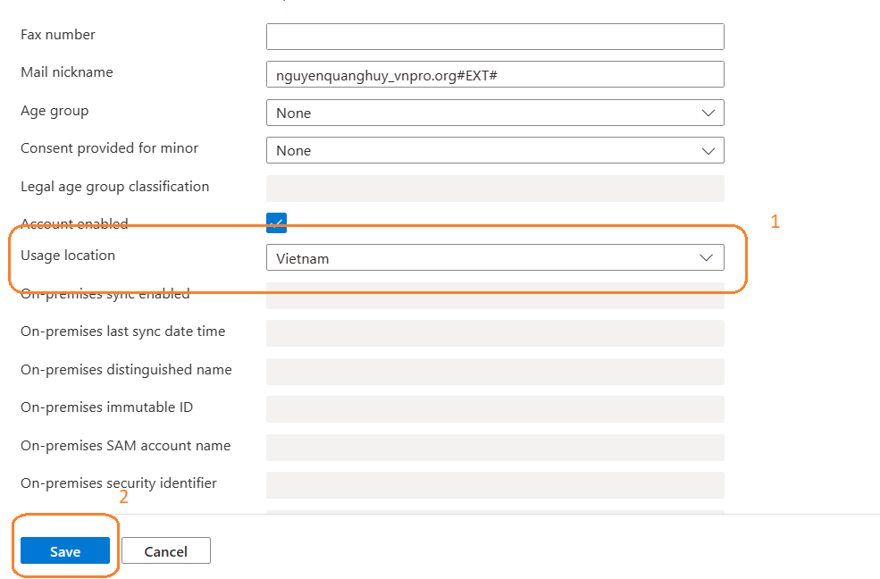
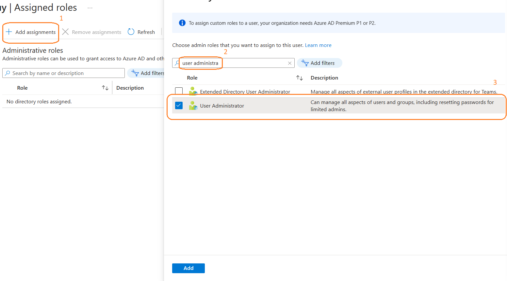
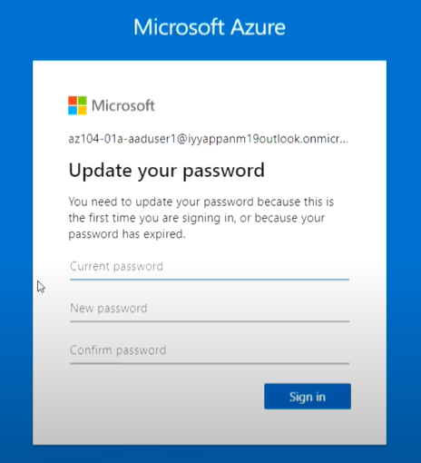
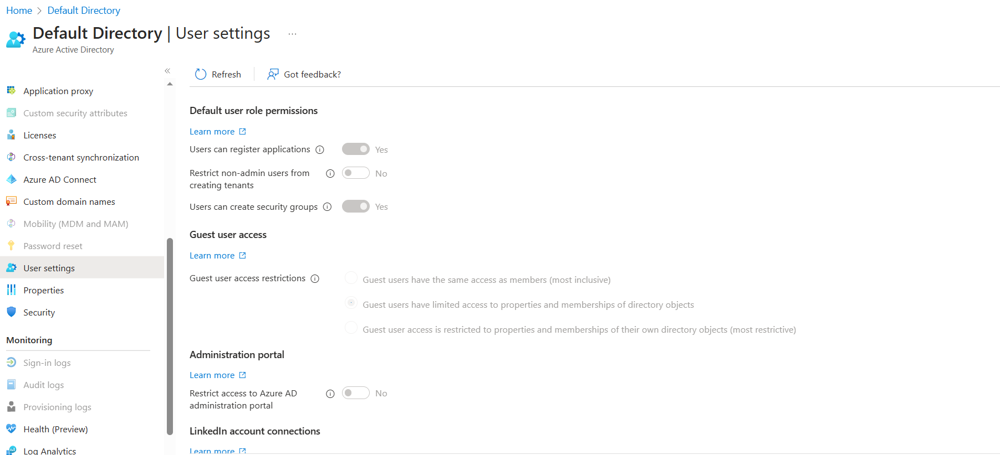
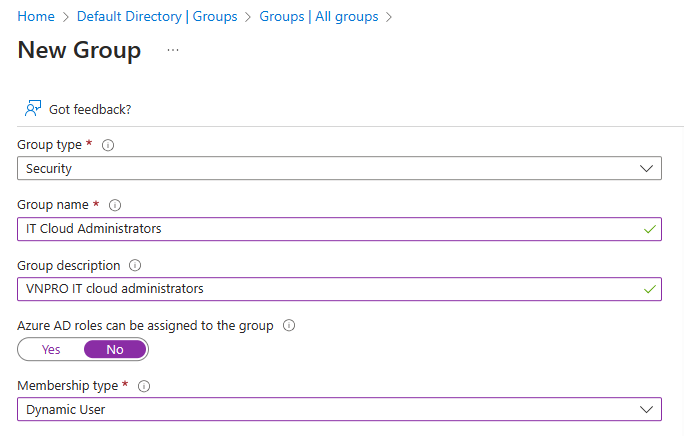
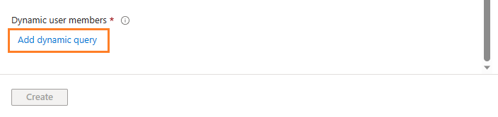
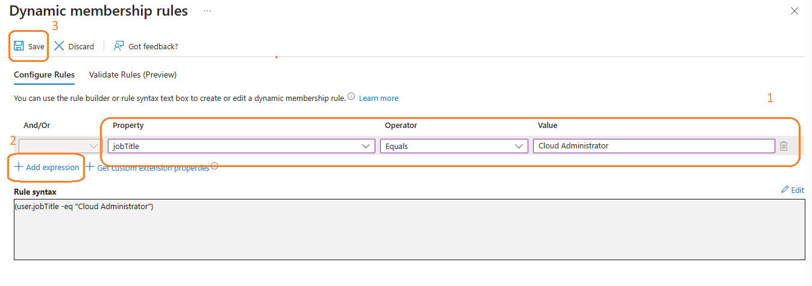
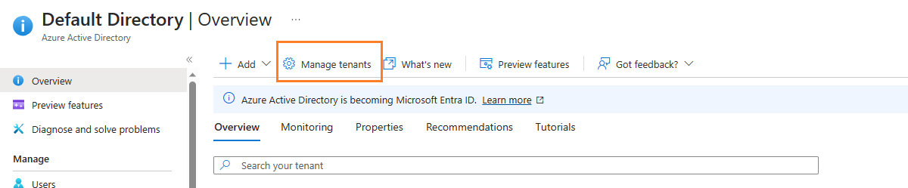
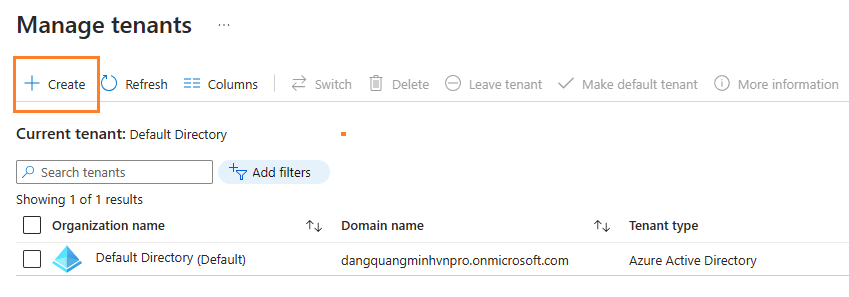

# Lab 08 - Manage Azure Active Directory Identities

## Lab scenario

Trong bài hướng dẫn này, chúng ta sẽ thực hiện tạo ra các Azure AD users và Azure AD groups sau đó cấu hình cho các Azure AD đó.

## Objectives

Trong bài lab này, bạn sẽ thực hiện:

+ Task 1: Tạo và cấu hình Azure AD users
+ Task 2: Tạo các Azure AD group cùng với assigned và dynamic membership
+ Task 3: Tạo ra một Azure Active Directory (AD) tenant
+ Task 4: Quản lý Azure AD guest users

## Architecture diagram

### Instructions

## Task 1: Tạo và cấu hình Azure AD users

1. Đăng nhập vào [Azure portal](https://portal.azure.com).

2. Tại Azure portal, tìm và chọn vào **Azure Active Directory**.

3. Tại Azure Active Directory blade, kéo xuống **Manage** section, chọn **Users**, sau đó chọn vào user account của bạn để hiển thị ra phần cài đặt **Profile*. 

4. Chọn **Edit properties**, và trong phần **Settings** tab, thiết lập **Usage location** thành **VietNam** và click **Save** để apply thay đổi.

    

5. Quay trở lại **Users - All users** blade, sau đó chọn **+ New user**.

6. Tạo ra một user mới với các thông tin như sau (để mặc định các trường thông tin không được cung cấp):

    | Setting | Value |
    | --- | --- |
    | User principal name | **vnpro-user01-xxx** |
    | Display name | **vnpro-user01-xxx** |
    | Auto-generate password | de-select |
    | Initial password | **VnPro@123456** |
    | Job title (Properties tab) | **Cloud Administrator** |
    | Department (Properties tab) | **IT** |
    | Usage location (Properties tab) | **VietNam** |

7. Trong danh sách các user, chọn vào user bạn mới vừa tạo ra.

8. Review các tùy chọn trong phần **Manage** và bạn có thể gán Azure AD roles assigned cho user account cũng như gán quyền cho user account đó truy cập đến Azure resources.

9. Trong **Manage** section, chọn **Assigned roles**, tiếp tục chọn **+ Add assignment** gán quyền **User administrator** cho user.

    >**Note**: Bạn có thể cần phải refresh lại để thấy roles đã được apply

    

10. Mở một cửa sổ **InPrivate** browser và đăng nhập vào [Azure portal](https://portal.azure.com) bằng user bạn mới vừa tạo ra. thay đổi password cũ thành một password an toàn hơn mà bạn muốn. 

    

11. Ở cửa sổ **InPrivate** browser, bên trong the Azure portal, tìm và chọn vào **Azure Active Directory**.

    >**Note**: Mặc dù user account này có thể truy cập Azure Active Directory tenant, tuy nhiên account này chưa có quyền truy cập nào vào tài nguyên Azure. Điều này là bình thường, vì nếu muốn truy cập bạn sẽ phải gán quyền cho user này trong phần **Azure Role-Based Access Control**.

12. Ở cửa sổ **InPrivate** browser, tại Azure AD blade, kéo xuống **Manage** section, chọn **User settings**, và thấy rằng bạn không có quyền để thay đổi tùy chọn cấu hình bên trong **User settings**.

    

13. Ở cửa sổ **InPrivate** browser, tại Azure AD blade, trong phần **Manage** section, chọn **Users**, tiếp theo chọn **+ New user**.

14. Tạo ra một user mới với các thông tin như sau (để mặc định các trường thông tin không được cung cấp):

    | Setting | Value |
    | --- | --- |
    | User principal name | **vnpro-user02-xxx** |
    | Display name | **vnpro-user02-xxx** |
    | Auto-generate password | de-select  |
    | Initial password | **VnPro@123456** |
    | Job title | **System Administrator** |
    | Department | **IT** |
    | Usage location | **Vietnam** |
    
15. Đăng xuất khỏi user az104-01a-aaduser1 và đóng trình duyệt.

## Task 2: Tạo các Azure AD group cùng với assigned và dynamic membership

1. Quay trở lại Azure portal và đăng nhập vào **user account** của bạn, di chuyển đến **Overview** blade của Azure AD tenant, và trong **Manage** section, chọn **Licenses**.

2. Trong **Manage** section, chọn **All products**.

3. Từ **Licenses - All products** blade, Lựa chọn **Azure Active Directory Premium P2**, và gán Azure AD Premium P2 license cho account của bạn và hai account mới vừa tạo.

4. Tại Azure portal, trở lại Azure AD tenant blade và chọn **Groups**.

5. click vào nút **+ New group** để tạo ra một group mới cùng các thiết lập sau:

    | Setting | Value |
    | --- | --- |
    | Group type | **Security** |
    | Group name | **IT Cloud Administrators - xxx** |
    | Group description | **VNPRO IT cloud administrators** |
    | Membership type | **Dynamic User** |

    

6. Chọn **Add dynamic query**.

    

7. Trên tab **Configure Rules** của **Dynamic membership rules** blade, tạo ra một rule mới với thiết lập như sau:

    | Setting | Value |
    | --- | --- |
    | Property | **jobTitle** |
    | Operator | **Equals** |
    | Value | **Cloud Administrator** |

    

8. Lưu rule lại bằng cách nhấn **+Add expression** và **Save**. Quay lại **New Group** blade, và chọn **Create**. 

9. Tại phần **Groups - All groups** blade của Azure AD tenant, chọn nút **+ New group** và tạo ra một group mới cùng các thiết lập sau:

    | Setting | Value |
    | --- | --- |
    | Group type | **Security** |
    | Group name | **IT System Administrators - xxx** |
    | Group description | **VNPRO IT system administrators** |
    | Membership type | **Dynamic User** |

10. Chọn **Add dynamic query**.

11. Tại tab **Configure Rules** của **Dynamic membership rules** blade, tạo ra một rule mới với thiết lập như sau:

    | Setting | Value |
    | --- | --- |
    | Property | **jobTitle** |
    | Operator | **Equals** |
    | Value | **System Administrator** |

12. Lưu rule lại bằng cách nhấn **+Add expression** và **Save**. Quay lại **New Group** blade, và chọn **Create**. 

13. Quay lại một lần nữa, tại phần **Groups - All groups** blade của Azure AD tenant, chọn nút **+ New group** và tạo ra một group mới cùng các thiết lập sau:

    | Setting | Value |
    | --- | --- |
    | Group type | **Security** |
    | Group name | **IT Lab Administrators - xxx** |
    | Group description | **VNPRO IT Lab administrators** |
    | Membership type | **Assigned** |
    
14. Chọn **No members selected**.

15. Tại **Add members** blade, Tìm và chọn group **IT Cloud Administrators** và **IT System Administrators**, quay lại **New Group** blade, và chọn **Create**. 

16. Tại **Groups - All groups** blade, chọn vào group **IT Cloud Administrators**, bền phần **Members** blade. Xác nhận rằng user **vnpro-user01-xxx** xuất hiện trong danh sách group members.

17. Quay lại **Groups - All groups** blade, chọn vào group **IT System Administrators**, on then display its **Members** blade. bền phần **Members** blade. Xác nhận rằng user **vnpro-user02-xxx** xuất hiện trong danh sách group members.

## Task 3: Tạo ra một Azure Active Directory (AD) tenant

1. Tại Azure portal, tìm và chọn vào **Azure Active Directory**.

2. Chọn **Manage tenants**, sau đó chuyển sang màn hình tiếp theo, chọn **+ Create**, và khai báo thông tin như sau:

    

    

    | Setting | Value |
    | --- | --- |
    | Directory type | **Azure Active Directory** |
    
3. Chọn **Next : Configuration**

    | Setting | Value |
    | --- | --- |
    | Organization name | **VNPRO Lab - xxx** |
    | Initial domain name | **vnprodomainxxx** | 
    | Country/Region | **Australia** |

4. Chọn **Review + create** và sau đó **Create**.

5. Hiển thị Azure AD tenant mới vừa tạo bằng cách chọn link phía sau dòng chữ **Click here to navigate to your new tenant: VNPRO Lab - xxx**.

## Task 4: Quản lý Azure AD guest users

1. Tại Azure portal sử dụng **VNPRO Lab - xxx** tenant, tìm và chọn vào **Azure Active Directory**, tại **Manage** section, chọn **Users**, và sau đó click **+ New user**.

2. Tạo ra một user mới với các thông tin như sau (để mặc định các trường thông tin không được cung cấp):

    | Setting | Value |
    | --- | --- |
    | User principal name | **vnpro-ADtenant-user-xxx** |
    | Display name | **vnpro-ADtenant-user-xxx** |
    | Auto-generate password | de-select  |
    | Initial password | **VnPro@123456** |
    | Job title | **System Administrator** |
    | Department | **IT** |

3. Click vào profile của user mới vừa tạo.

    >**Note**: Copy **User Principal Name** (user name + domain). Lúc sau bạn sẽ cần sử dụng đến nó.

4. Quay trở lại tenant **DEfAULT DIRECTORY**. 

5. Di chuyển đến **Users - All users** blade, sau đó chọn **+ Invite external user**.

    

6. Invite một guest user với thông tin như sau (để mặc định các trường thông tin không được cung cấp):

    | Setting | Value |
    | --- | --- |
    | Email | the User Principal Name you copied earlier in this task |
    | Display Name (Properties tab)  | **vnpro-ADtenant-user-xxx** |
    | Job title (Properties tab) | **Lab Administrator** |
    | Department (Properties tab) | **IT** |
    | Usage location (Properties tab) | **Vietnam** |

7. Chọn **Invite**. 

8. Trở lại **Users - All users** blade, chọn vào guest user account mới vừa invite.

9. Trong **az104-01b-aaduser1 - Profile** blade, chọn **Groups**.

10. Chọn **+ Add membership** và thêm guest user account vào group **IT Lab Administrators** .

## Task 5: Clean up resources

1. In the **Azure Portal** search for **Azure Active Directory** in the search bar. Within **Azure Active Directory** under **Manage** select **Licenses**. Once at **Licenses** under **Manage** select **All Products** and then select **Azure Active Directory Premium P2** item in the list. Proceed by then selecting **Licensed Users**. Select the user accounts **az104-01a-aaduser1** and **az104-01a-aaduser2** to which you assigned licenses in this lab, click **Remove license**, and, when prompted to confirm, click **Yes**.

2. Trong Azure portal, di chuyển đến **Users - All users** blade, xóa hết tất cả user accounts bạn đã tạo trong bài lab này.

4. Chuyển sang **Groups - All groups** blade, chọn các groups bạn tạo trong bài lab này, click **Delete**, và click **OK**.

5. Tại Azure Portal Navigate sử dụng **VNPRO Lab - xxx** tenant, đến **Users - All users** blade trong Azure AD, Xóa **vnpro-ADtenant-user-xxx** user account.

6. Quay lại **VNPRO Lab - Overview** blade của **VNPRO Lab - xxx** tenant, chọn **Manage tenants** và chọn xóa **VNPRO Lab - xxx** tenant. click **Get permission to delete Azure resources** link, trong phần **Properties** blade của Azure Active Directory, chỉnh **Access management for Azure resources** thành **Yes** và chọn **Save**.

7. Quay lại phần **Delete tenant 'VNPRO Lab'** blade và chọn **Refresh**, click **Delete**.

#### Review

Trong bài lab này, bạn đã thực hiện:

+ Task 1: Tạo và cấu hình Azure AD users
+ Task 2: Tạo các Azure AD group cùng với assigned và dynamic membership
+ Task 3: Tạo ra một Azure Active Directory (AD) tenant
+ Task 4: Quản lý Azure AD guest users
