# Lab 09 - VNet to VNet Connection

## Lab scenario

Bài Lab này hướng dẫn bạn tạo kết nối VPN Vnet to Vnet, các Virtual networks có thể khác regions hay khác subscriptions và thiết lập Vnet peering giữa 2 Vnet khác region.

## Objectives

Trong bài lab này, chúng ta sẽ thực hiện:
### Exercise 1: Kết Nối VNet to VNet
+ Task 1: Tạo 2 resource group ở 2 Region khác nhau
+ Task 2: Tạo Virtual network và Gateway subnet ở Southeast Asia và West Europe
+ Task 3: Tạo Virtual network gateway ở Southeast Asia và West Europe
+ Task 4: Tạo connection giữa Southeast Asia và West Europe
+ Task 5: Tạo connection giữa West Europe và Southeast Asia
+ Task 6: Kiểm tra kết nối VPN Vnet to Vnet

### Exercise 2. Thiết Lập VNet Peering
+ Task 1: Tạo Virtual networks
+ Task 2: Thiết lập VNet Peering
+ Task 3: Kiểm tra VNet Peering

## Instructions

# Exercise 1: Kết Nối VNet to VNet

## Task 1: Tạo 2 resource group ở 2 Region khác nhau

1. Đăng nhập vào [Azure portal](https://portal.azure.com).

2. Tại Azure portal, tìm và chọn vào từ khóa **Resource groups**, sau đó nhấn **+ Create**.

3. Tại màn hình **create resource group**, nhập các thông tin sau và ấn **Review + Create** và ấn **Create**.

    | Setting | Value |
    | --- | --- |
    | Subscription | **Chọn vào subscription của bạn** |
    | Resource group | **VPNLABRG-xxx** |
    | Regions | **Southeast Asia** |

    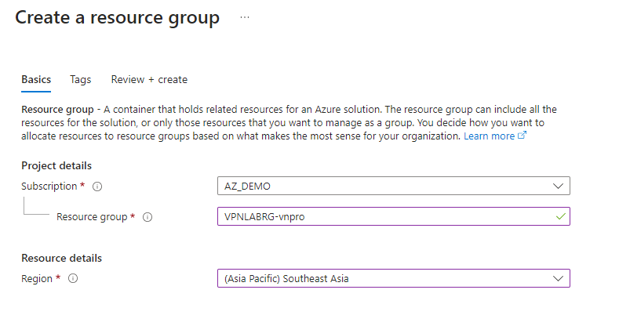

4. Thực hiện tạo thêm 1 resource group nữa ở West Europe, với các thông tin như sau:

    | Setting | Value |
    | --- | --- |
    | Subscription | **Chọn vào subscription của bạn** |
    | Resource group | **VPNRGEUROPE-xxx** |
    | Regions | **West Europe** |

    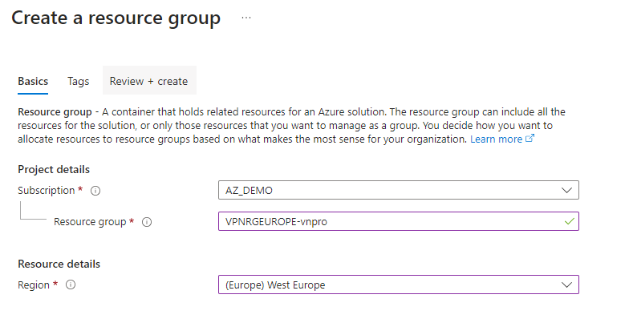

## Task 2: Tạo Virtual network và Gateway subnet ở Southeast Asia và West Europe

1. Tại Azure portal, tìm và chọn vào từ khóa **Virtual networks**, sau đó nhấn **+ Create**.

2. Màn hình Create virtual network nhập các thông tin sau:

    | Setting | Value |
    | --- | --- |
    | Subscription | **Chọn vào subscription của bạn** |
    | Resource group | **VPNLABRG-xxx** |
    | Name | **VPNNetwork-xxx** |
    | Regions | **Southeast Asia** |

3. Ấn Next sang phần **IP Addresses**

+ **IPv4 address space** xóa dãy ip có sẳn, nhập vào: **172.16.0.0/16**
+ Ấn **Add Subnet**

    | Setting | Value |
    | --- | --- |
    | Subnet name | **subnet1** |
    | Subnet Address range | **172.16.1.0/24** |

    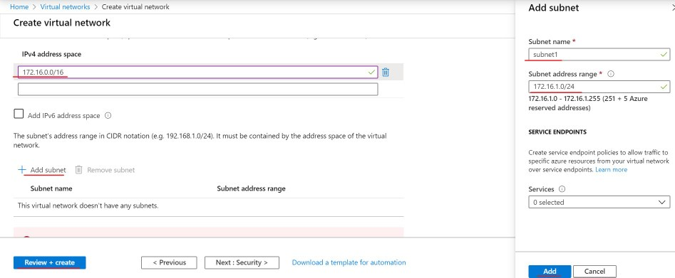

4. Click **Review + Create**, sau đó **Create**

5. Di chuyển đến VNet **VPNNetwork-xxx** vừa tạo.

6. Màn hình **VPNNetwork-xxx** bên trái chọn **Subnets**, tiếp thep chọn **+ Gateway subnet**.

7. Điền các thông tin sau rồi click **OK**:

    | Setting | Value |
    | --- | --- |
    | Address range (CIDR block) | **172.16.2.0/24** |
    | Route table | **None** |
    | Services | **0 selected** |
    | Delegate subnet to a service | **None** |

    

8. Tương tự tạo thêm một Virtual networks nữa nằm ở West Europe, tìm và chọn vào từ khóa **Virtual networks**, sau đó nhấn **+ Create**.

9. Màn hình Create virtual network nhập các thông tin sau:

    | Setting | Value |
    | --- | --- |
    | Subscription | **Chọn vào subscription của bạn** |
    | Resource group | **VPNRGEUROPE-xxx** |
    | Name | **NetworkEurope-xxx** |
    | Regions | **West Europe** |

10. Ấn Next sang phần **IP Addresses**

+ **IPv4 address space** xóa dãy ip có sẳn, nhập vào: **10.1.0.0/16**
+ Ấn **Add Subnet**

    | Setting | Value |
    | --- | --- |
    | Subnet name | **sub1** |
    | Subnet Address range | **10.1.0.0/24** 

11. Click **Review + Create**, sau đó **Create**
    
12. Di chuyển đến VNet **NetworkEurope-xxx** vừa tạo.

13. Màn hình **NetworkEurope-xxx** bên trái chọn **Subnets**, tiếp thep chọn **+ Gateway subnet**.

14. Điền các thông tin sau rồi click **OK**:

    | Setting | Value |
    | --- | --- |
    | Address range (CIDR block) | **10.1.1.0/24** |
    | Route table | **None** |
    | Services | **0 selected** |
    | Delegate subnet to a service | **None** |

## Task 3: Tạo Virtual network gateway ở Southeast Asia và West Europe

1. Tại Azure portal, tìm và chọn vào từ khóa **Virtual network gateways**, sau đó nhấn **+ Create**.

2. Màn hình Create Virtual network gateways nhập các thông tin sau:

    | Setting | Value |
    | --- | --- |
    | name | **GatewayVPN-xxx** |
    | Region | **Southeast Asia** |
    | Gateway type | **VPN** |
    | VPN type | **Route-based** |
    | SKU | **VpnGw1** |
    | Virtual network | **VPNNetwork-xxx** |

    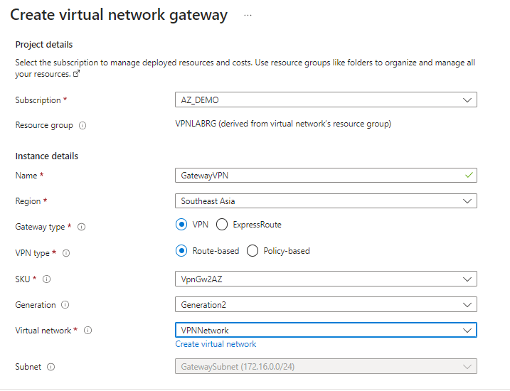

3. Tạo public IP

    | Setting | Value |
    | --- | --- |
    | Public IP address name | **VPN-IP-Public-1** |
    | Second Public IP address name | **VPN-IP-Public-2** |

    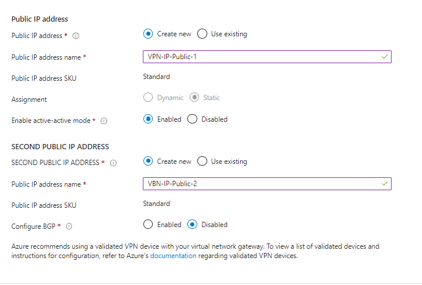

4. Click **Review + Create**, sau đó **Create**

>**Note**: Quá trình deploy Virtual network gateway có thể mất từ 15-30 phút tùy vào tốc độ mạng.

5. Tương tự tạo Virtual network gateway ở **West Europe**. Tìm và chọn vào từ khóa **Virtual network gateways**, sau đó nhấn **+ Create**

6. Màn hình Create Virtual network gateways nhập các thông tin sau:

    | Setting | Value |
    | --- | --- |
    | name | **GatewayEurope-xxx** |
    | Region | **West Europe** |
    | Gateway type | **VPN** |
    | VPN type | **Route-based** |
    | SKU | **VpnGw1** |
    | Virtual network | **NetworkEurope-xxx** |

7. Tạo public IP

    | Setting | Value |
    | --- | --- |
    | Public IP address name | **VPN-IP-Public-1** |
    | Second Public IP address name | **VPN-IP-Public-2** |

8. Click **Review + Create**, sau đó **Create**

>**Note**: Quá trình deploy Virtual network gateway có thể mất từ 15-30 phút tùy vào tốc độ mạng.

## Task 4: Tạo connection giữa Southeast Asia và West Europe

1. Tại Virtual network gateway, chọn **GatewayVPN** ở Southeast Asia

2. Màn hình **GatewayVPN-xxx**, bên trái chọn **Connections**, và chọn **Add**.

3. Tại trang Create connection, điền các thông tin như sau:

    | Setting | Value |
    | --- | --- |
    | Subscription | **Chọn vào subscription của bạn** |
    | Resource group | **VPNLABRG-xxx** |
    | Connection type | **Vnet-to-Vnet** |
    | Name | **Asia-to-EU** |
    | Region | **Southeast Asia** |

    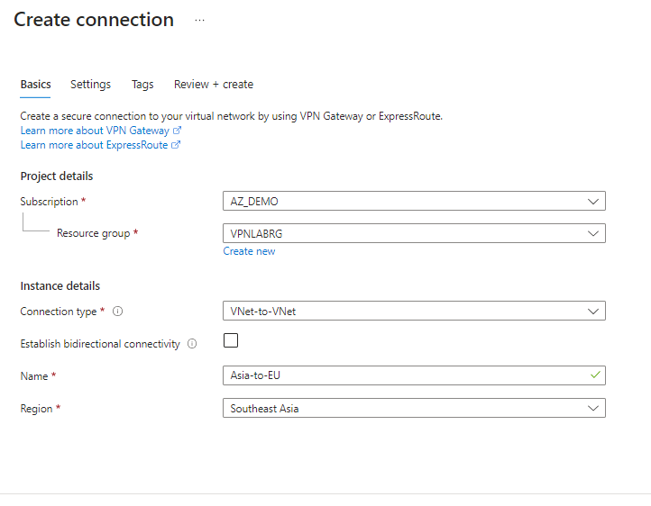

4. Tại tab Setting, thiết lập cấu hình như sau:
    
    | Setting | Value |
    | --- | --- |
    | First virtual network gateway | **GatewayVPN-xxx** |
    | Second virtual network gateway | **GatewayEurope-xxx** |
    | Shared key (PSK) | **VnPro@123** |

    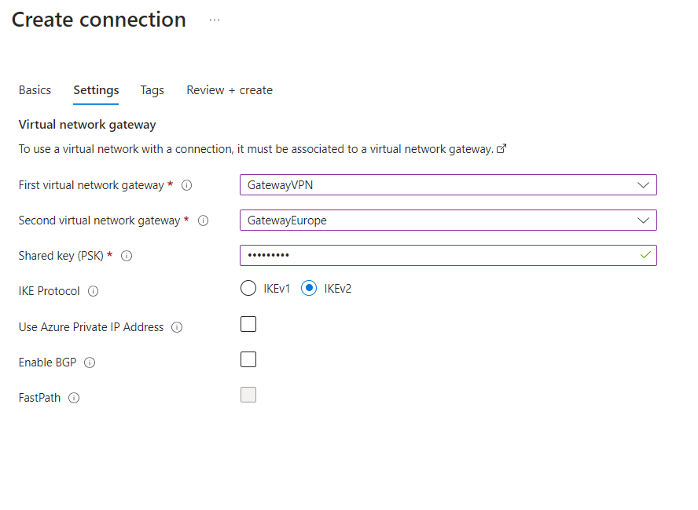
    
5. Click **Review + Create**, sau đó **Create**

## Task 5: Tạo connection giữa West Europe và Southeast Asia

1. Tại Virtual network gateway, chọn **GatewayEurope-xxx** ở West Europe

2. Màn hình **GatewayEurope-xxx**, bên trái chọn **Connections**, và chọn **Add**.

3. Tại trang Create connection, điền các thông tin như sau:

    | Setting | Value |
    | --- | --- |
    | Subscription | **Chọn vào subscription của bạn** |
    | Resource group | **VPNRGEUROPE-xxx** |
    | Connection type | **Vnet-to-Vnet** |
    | Name | **EU-to-Asia** |
    | Region | **West Europe** |

4. Tại tab Setting, thiết lập cấu hình như sau:
    
    | Setting | Value |
    | --- | --- |
    | First virtual network gateway | **GatewayEurope-xxx** |
    | Second virtual network gateway | **GatewayVPN-xxx** |
    | Shared key (PSK) | **VnPro@123** |
    
5. Click **Review + Create**, sau đó **Create**

## Task 6: Kiểm tra kết nối VPN Vnet to Vnet
Kiểm tra cả hai phía **GatewayVPN** & **GatewayEurope** xem **status** của 2 connections đã ở tình trạng **connected** hay chưa.

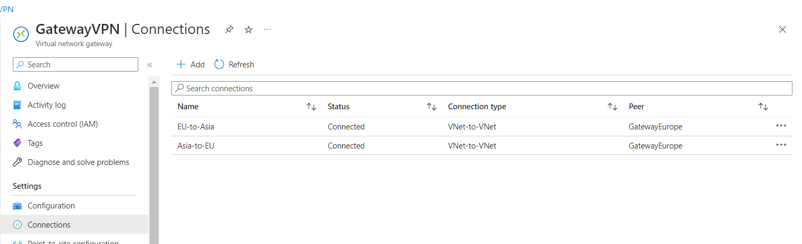

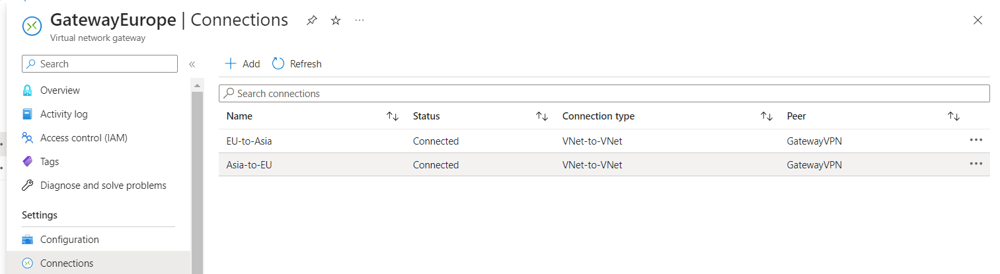

1. Tạo một máy ảo dùng Virtual network là **VPNNetwork** ở Southeast Asia, và một máy ảo dùng Virtual network là **NetworkEurope** ở West Europe.

2. Thực hiện lệnh ping giữa 2 máy ảo.

# Exercise 2. Thiết Lập VNet Peering

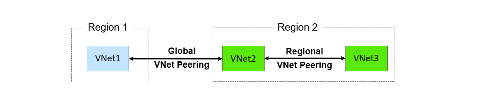

## Task 1: Tạo Virtual networks

Trong phần này bạn sẽ tạo 2 Virtual network ở hai region khác nhau.

+ Vnet1 ở Southeast Asia.
+ Vnet2 ở West Europe

1. Tạo Vnet1 ở Southeast Asia. Tại Azure Portal, menu trái chọn Virtual Networks và chọn +Add

2. Màn hình Create virtual network nhập các thông tin sau và ấn Create.

+ Subscription: chọn subscription của bạn.
+ Resource Group: Ấn **Create new** nhập vào **RGLab05-Asia**.
+ Name: **VNet1**
+ Region: **Southeast Asia**
+ Ấn Next: **Ip Addresses**
+ IPv4 address space xóa dãy ip có sẳn, nhập vào: **192.168.1.0/24**
+ Ấn **Add Subnet**
+ Subnet name: **subnet1**
+ Subnet Address range: **192.168.1.0/24**
+ Ấn **Add**
+ Ấn **Review + Create**
+ Ấn **Create**

3. Tạo Vnet2 ở West Europe. Tại Azure Portal, menu trái chọn Virtual Networks và chọn +Add

4. Màn hình Create virtual network nhập các thông tin sau và ấn Create.

+ Subscription: chọn subscription của bạn.
+ Resource Group: Ấn **Create new** nhập vào **RGLab05-Eu**.
+ Name: **VNet2**
+ Region: **West Europe**
+ Ấn Next: **Ip Addresses**
+ IPv4 address space xóa dãy ip có sẳn, nhập vào: **172.17.0.0/16**
+ Ấn **Add Subnet**
+ Subnet name: **subnet1**
+ Subnet Address range: **172.17.1.0/24**
+ Ấn **Add**
+ Ấn **Review + Create**
+ Ấn **Create**

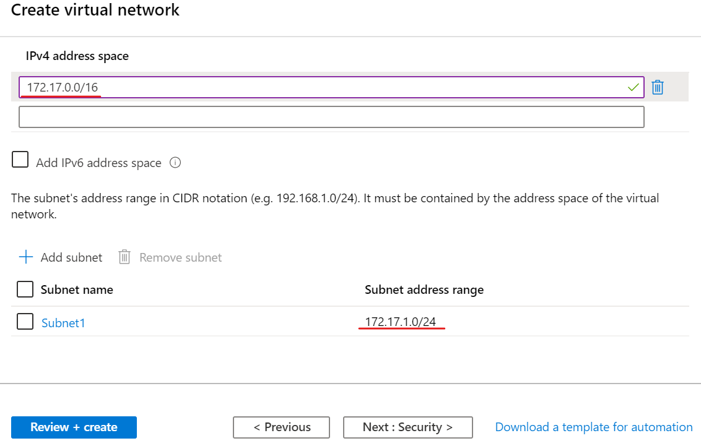

## Task 2: Thiết lập VNet Peering

1. Tại Azure Portal, menu trái chọn Virtual Networks, chọn VNet1 vừa tạo.

2. Màn hình Vnet1, menu trái chọn Peerings, và ấn + Add.

3. Màn hình Add Peering nhập các thông tin sau vầ ấn OK.

+ Name of peering from: **vnet1_to_vnet2** (chỉ dùng chữ, số, và dấu gạch dưới)
+ Virtual network deployment model: Chọn option **Resource manager**
+ Subcription: chọn Subcription của bạn.
+ Virtual network: chọn **Vnet2**.
+ Name of peering from: **vnet2_to_vnet1** (sẽ tự tạo cho Vnet2)
+ Allow forwarded traffic from Vnet2 to Vnet1: **Enable**
+ Allow forwarded traffic from Vnet1 to Vnet2: **Enable**

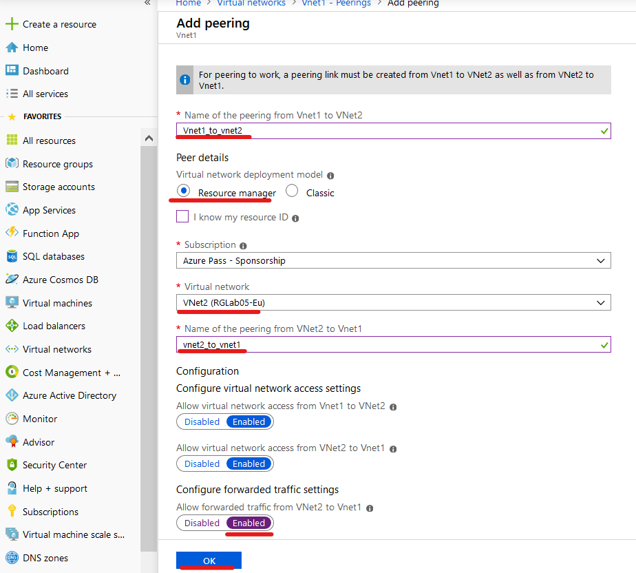

4. Chờ vài phút, cho cột peering status có trạng thái là **Connected**.

5. Tương tự qua Vnet2 kiểm tra cột peering status cũng có trạng thái là **Connected**

## Task 3: Kiểm tra VNet Peering

1. Tạo một máy ảo dùng Virtual network là Vnet1 ở Southeast Asia, và một máy ảo dùng Virtual network là Vnet2 ở West Europe.

2. Thực hiện lệnh ping giữa 2 máy ảo. (nhớ off firewall)

3. Tạo folder share truy cập tài nguyên 2 máy.

4. Xóa 2 Resource Group đã tạo.