# Lab 06 - Implement Traffic Management


## Lab scenario

Trong bài lab này, bạn sẽ được giao nhiệm vụ thử nghiệm quản lý lưu lượng truy cập mạng của các máy ảo Azure trong mô hình mạng **hub and spoke**. Bài lab này cần triển khai kết nối giữa các "spokes" (các điểm) bằng cách dựa vào user defined routes buộc lưu lượng truy cập phải đi qua "hub" (trung tâm), cũng như phân phối lưu lượng trên các máy ảo bằng cách sử dụng các bộ cân bằng tải layer 4 là layer 7. Vì lý do đó, bài lab sẽ sử dụng Azure Load Balancer (layer 4) và Azure Application Gateway (layer 7).

## Objectives

Trong bài lab này, chúng ta sẽ thực hiện:

+ Task 1: Xây dựng môi trường lab
+ Task 2: Cấu hình hub và spoke network topology
+ Task 3: Kiểm tra tính bắc cầu của virtual network peering
+ Task 4: Cấu hình routing trong mô hình hub and spoke
+ Task 5: Triển khai Azure Load Balancer
+ Task 6: Triển khai Azure Application Gateway

## Architecture diagram


### Instructions

## Exercise 1

## Task 1: Xây dựng môi trường lab

Trong task này, bạn sẽ triển khai bốn máy ảo vào trong cùng một Azure region. Hai máy ảo đầu tiên sẽ nằm trong một hub virtual network (mạng ảo trung tâm), trong khi hai máy ảo còn lại sẽ chia đều cho hai spoke virtual network riêng.

1. Đăng nhập vào [Azure portal](https://portal.azure.com).

1. Trong Azure portal, mở **Azure Cloud Shell** bằng cách chọn vào biểu tưởng bên phải thanh menu của Azure Portal.

1. Nếu chương trình yêu cầu bạn chọn **Bash** hay **PowerShell**, chọn **PowerShell**.

1. trong phần toolbar của Cloud Shell, click vào biểu tượng **Upload/Download files**, trong drop-down menu, chọn **Upload** sau đó upload 2 file **\\file-labs\\10\\az104-06-vms-loop-template.json** và **\\file-labs\\10\\az104-06-vms-loop-parameters.json** vào bên trong thư mục /home/user của Cloud Shell.

1. Tại trình Cloud Shell, chạy các lệnh sau để tạo ra resourse group dùng để lưu trữ tài nguyên lab (thay thế '[Azure_region]' bằng một Azure region mà bạn dự định deploy các máy ảo của mình lên đó)(Bạn có thể sử dụng "(Get-AzLocation).Location" cmdlet để xem danh sách các region):

    ```powershell 
    $location = '[Azure_region]'
    ```
    
    Bây giờ đến tên resource group:
    ```powershell
    $rgName = 'az104-06-rg1'
    ```
    
    và cuối cùng là tạo ra resource group mà bạn mong muốn:
    ```powershell
    New-AzResourceGroup -Name $rgName -Location $location
    ```


1. Tại trình Cloud Shell, chạy lệnh sau để tạo ra 3 virtual network và bốn Azure VMs bên trong bằng cách sử dụng file template and parameter bạn đã upload lên:

    >**Note**: Bạn sẽ được yêu cầu nhập Admin password.

   ```powershell
   New-AzResourceGroupDeployment `
      -ResourceGroupName $rgName `
      -TemplateFile $HOME/az104-06-vms-loop-template.json `
      -TemplateParameterFile $HOME/az104-06-vms-loop-parameters.json
   ```

    >**Note**: Đợi cho quá trình deploy hoàn thành trước khi tiến hành thực hiện bước tiếp theo. Quá trình này mất khoảng 5 phút. 

1. Tại trình Cloud Shell, chạy lệnh sau để cài đặt Network Watcher extension trên các Azure VMs đã được deploy trong task trước:

   ```powershell
   $rgName = 'az104-06-rg1'
   $location = (Get-AzResourceGroup -ResourceGroupName $rgName).location
   $vmNames = (Get-AzVM -ResourceGroupName $rgName).Name

   foreach ($vmName in $vmNames) {
     Set-AzVMExtension `
     -ResourceGroupName $rgName `
     -Location $location `
     -VMName $vmName `
     -Name 'networkWatcherAgent' `
     -Publisher 'Microsoft.Azure.NetworkWatcher' `
     -Type 'NetworkWatcherAgentWindows' `
     -TypeHandlerVersion '1.4'
   }
   ```

    >**Note**: Đợi cho quá trình deploy hoàn thành trước khi tiến hành thực hiện bước tiếp theo. Quá trình này mất khoảng 5 phút. 


1. Đóng trình cloudshell lại.

## Task 2: Cấu hình hub và spoke network topology

Trong task này, bạn sẽ cấu hình local peering giữa các vnet bạn đã deploy trong những task trước để tạo ra một mô hình mạng hub and spoke.

1. Tại Azure portal, tìm và chọn vào **Virtual networks**.

1. Tại danh sách các virtual networks, chọn **az104-06-vnet2**.

1. Tại **az104-06-vnet2** blade, select **Properties**. 

1. Trong phần **az104-06-vnet2 \| Properties**, lưu lại giá trị **Resource ID**.

    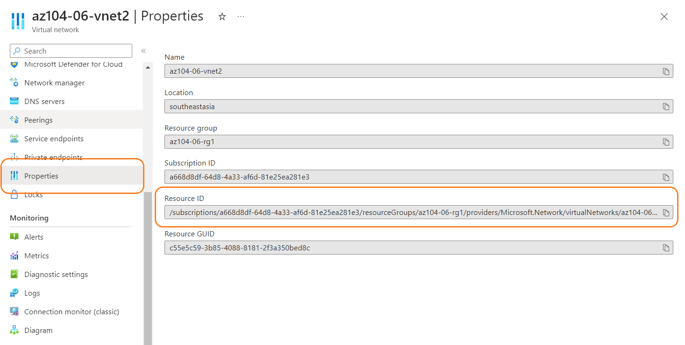

1. Quay lại danh sách các virtual networks, chọn **az104-06-vnet3**.

1. Tại **az104-06-vnet3** blade, select **Properties**. 

1. Trong phần **az104-06-vnet3 \| Properties**, lưu lại giá trị **Resource ID**.

    >**Note**: Bạn sẽ cần giá trị ResourceID của 2 vnet đó để sử dụng sau

1. Tại danh sách các virtual networks, chọn **az104-06-vnet01**.

1. trong phần **az104-06-vnet01** virtual network blade, tại **Settings** section, chọn **Peerings** và sau đó click **+ Add**.

    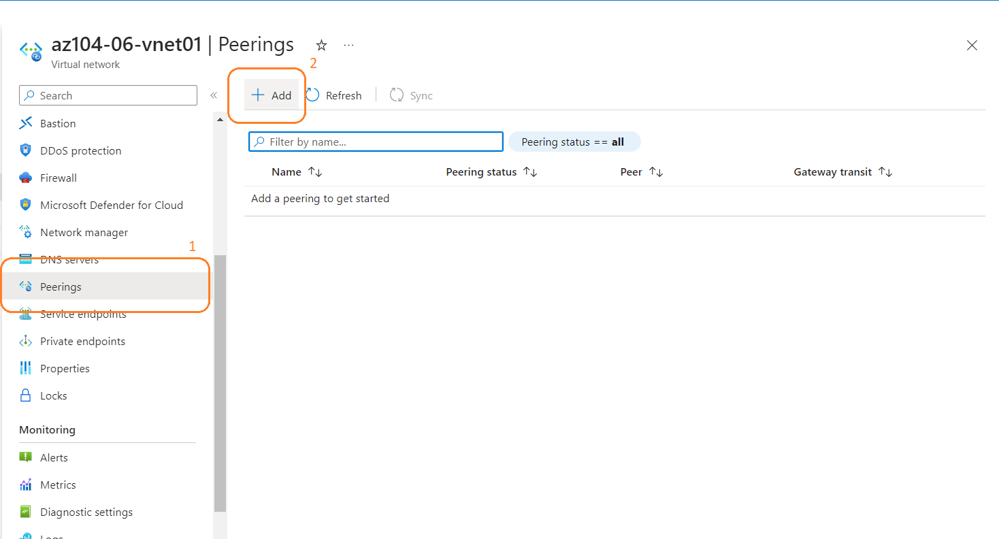

1. Thêm một peering với cầu hình như sau (để các giá trị khác mặc định) và click **Add**:

    | Setting | Value |
    | --- | --- |
    | This virtual network: Peering link name | **az104-06-vnet01_to_az104-06-vnet2** |
    | Traffic to remote virtual network | **Allow (default)** |
    | Traffic forwarded from remote virtual network | **Block traffic that originates from outside this virtual network** |
    | Virtual network gateway | **None (default)** |
    | Remote virtual network: Peering link name | **az104-06-vnet2_to_az104-06-vnet01** |
    | Virtual network deployment model | **Resource manager** |
    | I know my resource ID | enabled |
    | Resource ID | giá trị resourceID **az104-06-vnet2** bạn đã lưu lại trước đó |
    | Traffic to remote virtual network | **Allow (default)** |
    | Traffic forwarded from remote virtual network | **Allow (default)** |
    | Virtual network gateway | **None (default)** |

    >**Note**: Đợi đến khi quá trình thực hiện thành công.

    >**Note**: Bước này thực hiện thiết lập hai local peerings - một là từ az104-06-vnet01 đến az104-06-vnet2 và cái còn lại là từ az104-06-vnet2 đến az104-06-vnet01.

    >**Note**: **Allow forwarded traffic** cần phải được bật để tạo điều kiện định tuyến giữa các spoke virtual network mà bạn sẽ triển khai ở các bước trong trong bài lab.

1. Tại **az104-06-vnet01** virtual network blade, ở **Settings** section, chọn **Peerings** và click **+ Add**.

1. Add a peering with the following settings (leave others with their default values) and click **Add**:

    | Setting | Value |
    | --- | --- |
    | This virtual network: Peering link name | **az104-06-vnet01_to_az104-06-vnet3** |
    | Traffic to remote virtual network | **Allow (default)** |
    | Traffic forwarded from remote virtual network | **Block traffic that originates from outside this virtual network** |
    | Virtual network gateway | **None (default)** |
    | Remote virtual network: Peering link name | **az104-06-vnet3_to_az104-06-vnet01** |
    | Virtual network deployment model | **Resource manager** |
    | I know my resource ID | enabled |
    | Resource ID | giá trị resourceID **az104-06-vnet3** bạn đã lưu lại trước đó |
    | Traffic to remote virtual network | **Allow (default)** |
    | Traffic forwarded from remote virtual network | **Allow (default)** |
    | Virtual network gateway | **None (default)** |

    >**Note**: Bước này thực hiện thiết lập hai local peerings - một là từ az104-06-vnet01 đến az104-06-vnet3 và cái còn lại là từ az104-06-vnet3 đến az104-06-vnet01. Bước này hoàn thành set up mô hình "hub and spoke" (với hai spoke virtual network).

    >**Note**: **Allow forwarded traffic** cần phải được bật để tạo điều kiện định tuyến giữa các spoke virtual network mà bạn sẽ triển khai ở các bước trong trong bài lab.

## Task 3: Kiểm tra tính bắc cầu của virtual network peering

Trong task này, bạn sẽ kiểm tra tính bắc cầu của virtual network peering bằng cách sử dụng Network Watcher.

1. Tại Azure portal, tìm và chọn vào **Network Watcher**.

1. Tại **Network Watcher** blade, bạn sẽ thấy dịch vụ Network Watcher đã được bật ở region mà bạn đang sử dụng.

    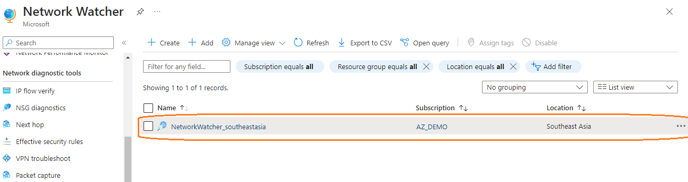

1. Tại **Network Watcher** blade, tìm đến **Connection troubleshoot**.

    

1. Bên trong **Network Watcher - Connection troubleshoot** blade, khởi tạo Connection troubleshoot với cấu hình như sau:

    | Setting | Value |
    | --- | --- |
    | Subscription | **Chọn vào subscription mà bạn sử dụng trong bài lab** |
    | Resource group | **az104-06-rg1** |
    | Source type | **Virtual machine** |
    | Virtual machine | **az104-06-vm0** |
    | Destination | **Specify manually** |
    | URI, FQDN or IPv4 | **10.62.0.4** |
    | Protocol | **TCP** |
    | Destination Port | **3389** |

    > **Note**: **10.62.0.4** đại diện cho IP private của **az104-06-vm2**

1. Chọn **Run diagnostic tests** và đợi đến khi kết quả được trả về. Đảm bảo rằng status là **Success**. Xem lại netwỏk path và lưu ý rằng kết nối ở đây là trực tiếp, không có bất kỳ hops trung gian nào giữa hai máy ảo.

    > **Note**: Điều này hoàn toàn hợp lý vì hub virtual network thì được peering trực tiếp với spoke virtual network đầu tiên.

    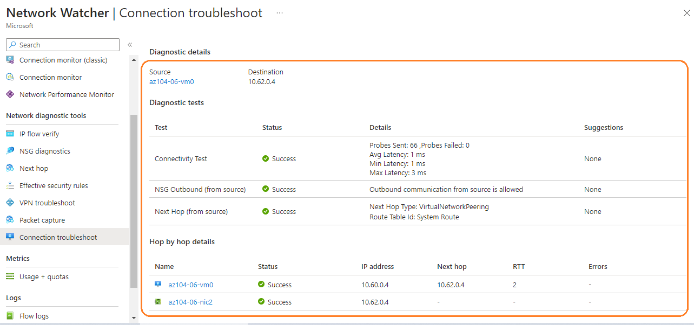

1. Vẫn tại **Network Watcher - Connection troubleshoot** blade, khởi tạo Connection troubleshoot với cấu hình như sau:

    | Setting | Value |
    | --- | --- |
    | Subscription | **Chọn vào subscription mà bạn sử dụng trong bài lab** |
    | Resource group | **az104-06-rg1** |
    | Source type | **Virtual machine** |
    | Virtual machine | **az104-06-vm0** |
    | Destination | **Specify manually** |
    | URI, FQDN or IPv4 | **10.63.0.4** |
    | Protocol | **TCP** |
    | Destination Port | **3389** |

    > **Note**: **10.63.0.4** đại diện cho IP private của **az104-06-vm3**

1. Chọn **Run diagnostic tests** và đợi đến khi kết quả được trả về. Đảm bảo rằng status là **Success**. Xem lại netwỏk path và lưu ý rằng kết nối ở đây là trực tiếp, không có bất kỳ hops trung gian nào giữa hai máy ảo.

    > **Note**: Điều này hoàn toàn hợp lý vì hub virtual network thì được peering trực tiếp với spoke virtual network đầu tiên.

    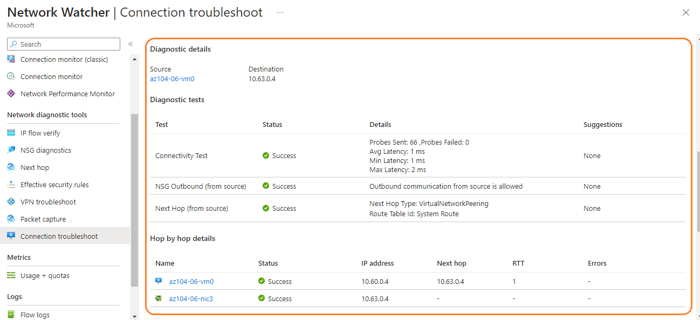

1. Vẫn tại **Network Watcher - Connection troubleshoot** blade, khởi tạo Connection troubleshoot với cấu hình như sau:

    | Setting | Value |
    | --- | --- |
    | Subscription | **Chọn vào subscription mà bạn sử dụng trong bài lab** |
    | Resource group | **az104-06-rg1** |
    | Source type | **Virtual machine** |
    | Virtual machine | **az104-06-vm2** |
    | Destination | **Specify manually** |
    | URI, FQDN or IPv4 | **10.63.0.4** |
    | Protocol | **TCP** |
    | Destination Port | **3389** |

1. Chọn **Run diagnostic tests** và đợi đến khi kết quả được trả về. Lần này thì status là **Fail**.

    > **Note**: Điều này được dự đoán từ trước, do hai spoke virtual networks thì không được peering với nhau **(virtual network peering không có tính chất bắc cầu)**.

## Task 4: Cấu hình routing trong mô hình hub and spoke

Trong task này, bạn sẽ thực hiện cấu hình và kiểm tra kết nối giữa hai spoke virtual network bằng cách bật IP forwarding trên network interface của máy ảo **az104-06-vm0**, bật routing bên trong hệ điều hành của máy ảo, và cấu hình user-defined routes trên spoke virtual network.

1. Tại Azure portal, tìm và chọn **Virtual machines**.

1. Tại **Virtual machines** blade, trong phần danh sách các máy ảo, click **az104-06-vm0**.

1. tại **az104-06-vm0** virtual machine blade, trong **Settings** section, click **Networking**.

1. Click **az104-06-nic0** link, on the **az104-06-nic0** network interface blade, Trong **Settings** section, click **IP configurations**.

    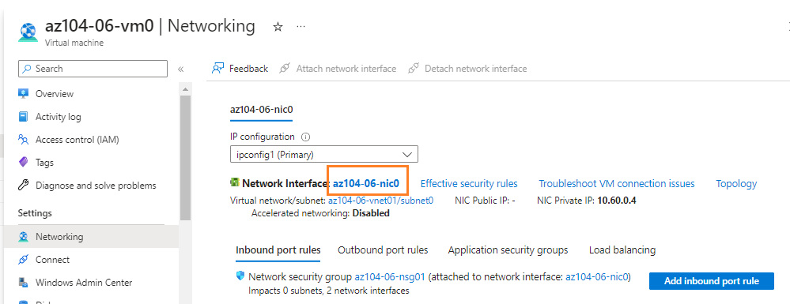

1. Chỉnh **IP forwarding** thành **Enabled** và apply.

   > **Note**: Setting này yêu cầu **az104-06-vm0** hoạt động như một router, định tuyến lưu lượng truy cập giữa hai spoke virtual networks.

   > **Note**: Bây giờ bạn cần pải cấu hình hệ điều hành của **az104-06-vm0** virtual machine để hỗ trợ routing.

    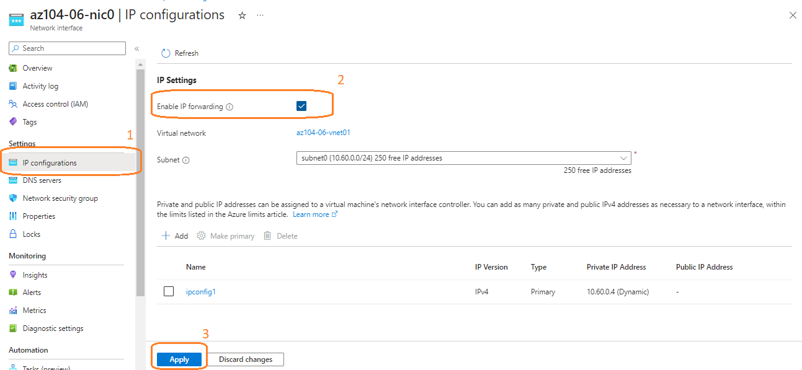

1. Tại Azure portal, di chuyển trở về **az104-06-vm0** Azure virtual machine blade và click **Overview**.

1. Bên trong **az104-06-vm0** blade, ở **Operations** section, chọn **Run command**, và trong danh sách các command có sẵn, click **RunPowerShellScript**.

    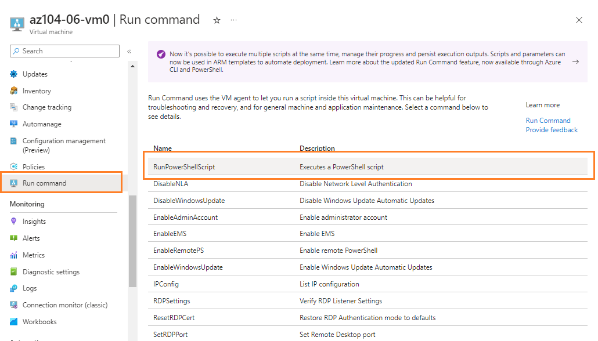

1. Ở tại khu vực **Run Command Script**, nhập lệnh sau và click **Run** để cài đặt Remote Access Windows Server role.

   ```powershell
   Install-WindowsFeature RemoteAccess -IncludeManagementTools
   ```

    > **Note**: Đợi để đến khi command thực thi thành công.

    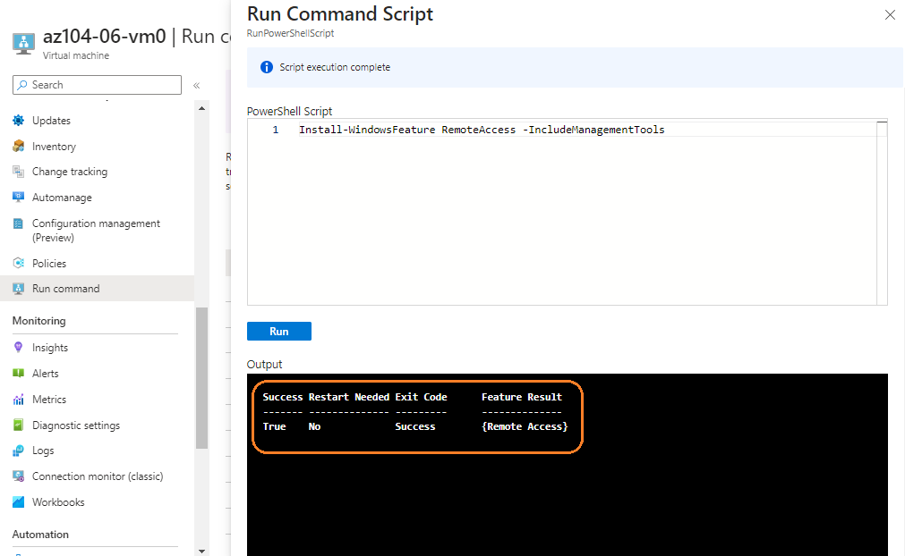

1. Vẫn tại **Run Command Script** blade, nhập lệnh sau và click **Run** để cài đặt Routing role service.

   ```powershell
   Install-WindowsFeature -Name Routing -IncludeManagementTools -IncludeAllSubFeature

   Install-WindowsFeature -Name "RSAT-RemoteAccess-Powershell"

   Install-RemoteAccess -VpnType RoutingOnly

   Get-NetAdapter | Set-NetIPInterface -Forwarding Enabled
   ```

   > **Note**: Đợi để đến khi command thực thi thành công.

   > **Note**: Bây giờ bạn cần phải tạo và cấu hình user defined routes trên các spoke virtual network.

    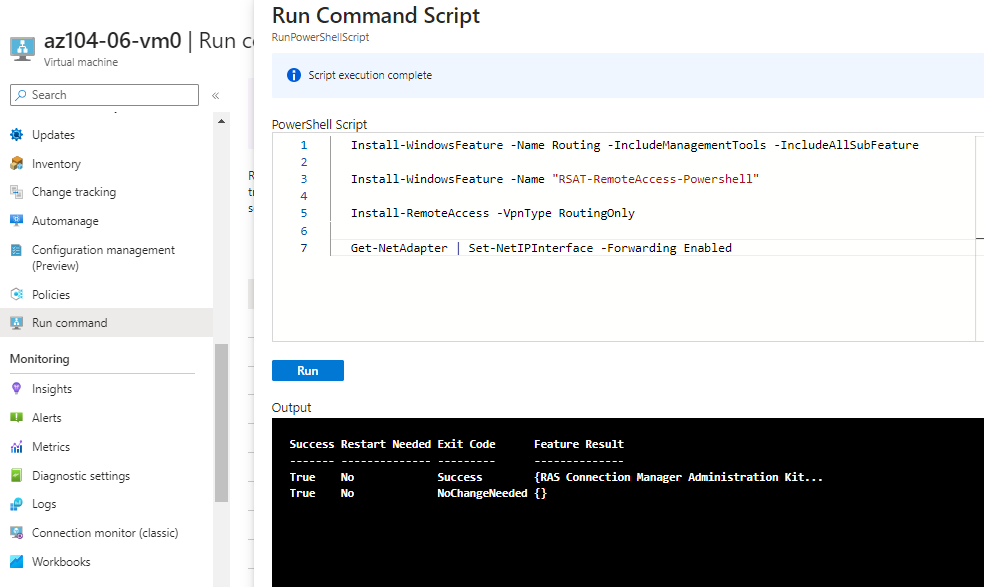

1. Tại Azure portal, tìm và chọn **Route tables**, tại **Route tables** blade, click **+ Create**.

1. Tạo ra route table với thiết lập như sau:

    | Setting | Value |
    | --- | --- |
    | Subscription | **Chọn vào subscription mà bạn sử dụng trong bài lab**  |
    | Resource group | **az104-06-rg1** |
    | Region | **Tương tự như the Azure region mà bạn sử dụng để tạo trong các virtual network** |
    | Name | **az104-06-rt23** |
    | Propagate gateway routes | **No** |

1. Click **Review and Create** và chọn **Create** để thực hiện deploy.

1. Click **Go to resource**.

1. Tại **az104-06-rt23** route table blade, trong **Settings** section, chọn **Routes**, và sau đó click **+ Add**.

1. Thêm một route mới với thiết lập như sau:

    | Setting | Value |
    | --- | --- |
    | Route name | **az104-06-route-vnet2-to-vnet3** |
    | Address prefix destination | **IP Addresses** |
    | Destination IP addresses/CIDR ranges | **10.63.0.0/20** |
    | Next hop type | **Virtual appliance** |
    | Next hop address | **10.60.0.4** |

1. Click **Add**

1. Quay lại **az104-06-rt23** route table blade, trong **Settings** section, chọn **Subnets**, sau đó chọn **+ Associate**.

1. gắn vào  route table **az104-06-rt23** với subnet như sau:

    | Setting | Value |
    | --- | --- |
    | Virtual network | **az104-06-vnet2** |
    | Subnet | **subnet0** |

1. Click **Add**

1. Trở lại **Route tables** blade và click **+ Create**.

1. Tạo ra một route table mới với thiết lập như sau: (leave others with their default values):

    | Setting | Value |
    | --- | --- |
    | Subscription | **Chọn vào subscription mà bạn sử dụng trong bài lab** |
    | Resource group | **az104-06-rg1** |
    | Region | **Tương tự như the Azure region mà bạn sử dụng để tạo trong các virtual network**  |
    | Name | **az104-06-rt32** |
    | Propagate gateway routes | **No** |

1. Chọn **Review and Create** và sau đó chọn **Create** để thực hiện deploy.

1. Click **Go to resource**.

1. Tại **az104-06-rt32** route table blade, trong **Settings** section, chọn **Routes**, và sau đó click **+ Add**.

1. Thêm một route mới với thiết lập như sau:

    | Setting | Value |
    | --- | --- |
    | Route name | **az104-06-route-vnet3-to-vnet2** |
    | Address prefix destination | **IP Addresses** |
    | Destination IP addresses/CIDR ranges | **10.62.0.0/20** |
    | Next hop type | **Virtual appliance** |
    | Next hop address | **10.60.0.4** |

1. Click **OK**

1. Quay lại **az104-06-rt32** route table blade, trong **Settings** section, chọn **Subnets**, sau đó chọn **+ Associate**.

1. Associate the route table **az104-06-rt32** with the following subnet:

    | Setting | Value |
    | --- | --- |
    | Virtual network | **az104-06-vnet3** |
    | Subnet | **subnet0** |

1. Click **OK**

1. Tại Azure portal, di chuyển đến **Network Watcher - Connection troubleshoot** blade.

1. Trong **Network Watcher - Connection troubleshoot** blade, sử dụng thiết lập như sau:

    | Setting | Value |
    | --- | --- |
    | Subscription | **Chọn vào subscription mà bạn sử dụng trong bài lab** |
    | Resource group | **az104-06-rg1** |
    | Source type | **Virtual machine** |
    | Virtual machine | **az104-06-vm2** |
    | Destination | **Specify manually** |
    | URI, FQDN or IPv4 | **10.63.0.4** |
    | Protocol | **TCP** |
    | Destination Port | **3389** |

1. Click **Run diagnostic tests** và đợi đến khi kết quả được trả về. Xác nhận rằng status là **Success**. Xem lại network path và thấy rằng traffic đã được route qua **10.60.0.4** sau đó mới đến địa chỉ đích. Nếu status là **Fail**, bạn có thể stop sau đó start **az104-06-vm0** sau đó thử lại.

    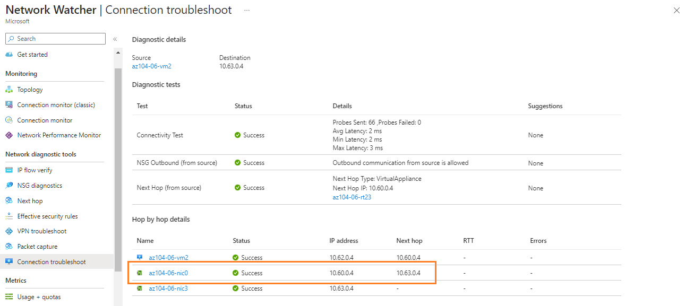

    > **Note**: Điều này đúng với những gì chúng ta đang làm, bới vì traffic giữa các spoke virtual networks bây giờ đã được route thông qua virtual machine nằm trong hub virtual network, có chức năng như một router.

    > **Note**: Bạn có thể **Network Watcher** để xem mô hình của network.
    
    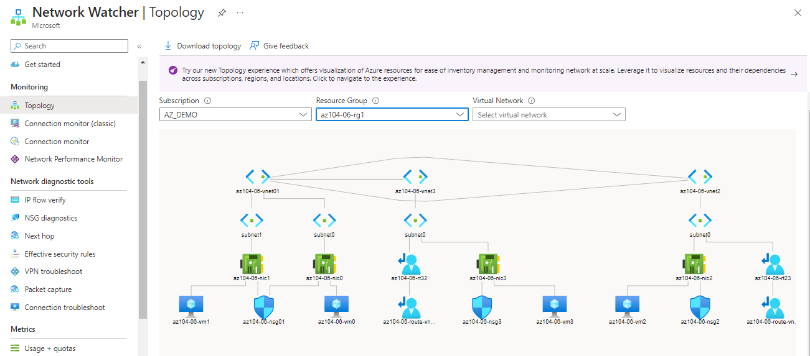    

## Task 5: Triển khai Azure Load Balancer

Trong task này, bạn sẽ triển khai một Azure Load Balancer đặt ở phía trước hai Azure virtual machines bên trong hub virtual network.

1. Tại Azure portal, tìm và chọn **Load balancers**, trong **Load balancers** blade, click **+ Create**.

1. Tạo ra một load balancer với cấu hình như sau sau đó click **Next : Frontend IP configuration**:

    | Setting | Value |
    | --- | --- |
    | Subscription | **Chọn vào subscription mà bạn sử dụng trong bài lab** |
    | Resource group | **az104-06-rg4** (create new) |
    | Name | **az104-06-lb4** |
    | Region | **Tương tự như the Azure region mà bạn sử dụng để tạo các tài nguyên khác trong bài lab này** |
    | SKU  | **Standard** |
    | Type | **Public** |
	| Tier | **Regional** |
    
1. Chuyển sang tab **Frontend IP configuration**, click **Add a frontend IP configuration** và sử dụng thiết lập sau:  
     
    | Setting | Value |
    | --- | --- |
    | Name | **az104-06-fe4** |
    | IP type | IP address |
    | Public IP address | Select **Create new** |
    
1. Tại hộp thoại **Add a public IP address**, sử dụng cấu hình như sau rồi click **OK** sau đó **Add**. Sau khi hoàn thành, click **Next: Backend pools**. 
     
    | Setting | Value |
    | --- | --- |
    | Name | **az104-06-pip4** |
    | SKU | Standard |
    | Tier | Regional |
    | Assignment | Static |
    | Routing Preference | **Microsoft network** |

1. Tại tab **Backend pools**, chọn **Add a backend pool** với cấu hình như sau. Click **+ Add** (hai lần) sau đó chọn  **Next:Inbound rules**. 

    | Setting | Value |
    | --- | --- |
    | Name | **az104-06-lb4-be1** |
    | Virtual network | **az104-06-vnet01** |
	| Backend Pool Configuration | **NIC** | 
    | IP Version | **IPv4** |
	| Click **Add** to add a virtual machine |  |
    | az104-06-vm0 | **check the box** |
    | az104-06-vm1 | **check the box** |


1. Trong phần **Inbound rules** tab, click **Add a load balancing rule**. Thêm các rule như sau. Sau khi hoàn thành click **Add**.

    | Setting | Value |
    | --- | --- |
    | Name | **az104-06-lb4-lbrule1** |
    | IP Version | **IPv4** |
    | Frontend IP Address | **az104-06-fe4** |
    | Backend pool | **az104-06-lb4-be1** |    
	| Protocol | **TCP** |
    | Port | **80** |
    | Backend port | **80** |
	| Health probe | **Create new** |
    | Name | **az104-06-lb4-hp1** |
    | Protocol | **TCP** |
    | Port | **80** |
    | Interval | **5** |
    | Close the create health probe window | **OK** | 
    | Session persistence | **None** |
    | Idle timeout (minutes) | **4** |
    | TCP reset | **Disabled** |
    | Floating IP | **Disabled** |
	| Outbound source network address translation (SNAT) | **Recommended** |

1. Click **Review and create**. Đảm bảo không có thông tin nào nhập sai, sau đó click **Create**. 

1. Đợi cho load balancer deploy xong sau đó click **Go to resource**.  

1. Chọn **Frontend IP configuration** từ Load Balancer resource page. Copy địa chỉ IP.

      


1. Mở một tab trình duyệt khác và truy cập tới địa chỉ IP. Xác nhận rằng trình duyệt hiển thị message **Hello World from az104-06-vm0** or **Hello World from az104-06-vm1**.

    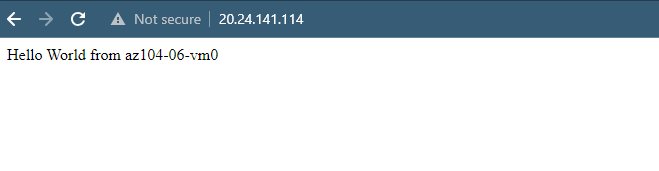 

    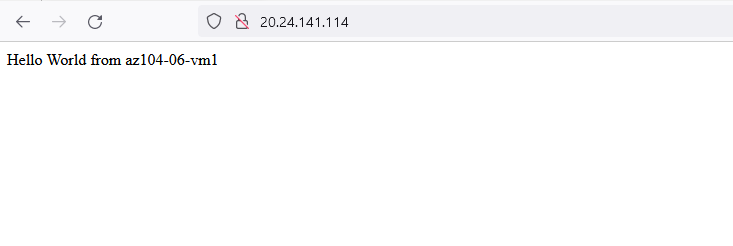   

## Task 6: Triển khai Azure Application Gateway

Trong task này, bạn sẽ triển khai một Azure Application Gateway phía trước hai Azure virtual machines trong hai spoke virtual network.

1. Tại Azure portal, tìm và chọn **Virtual networks**.

1. Tại **Virtual networks** blade, phần danh sách các vnet, click **az104-06-vnet01**.

1. Trong **az104-06-vnet01** virtual network blade, tại **Settings** section, click **Subnets**, sau đó click **+ Subnet**.

1. Thêm một subnet với cấu hình sau:

    | Setting | Value |
    | --- | --- |
    | Name | **subnet-appgw** |
    | Subnet address range | **10.60.3.224/27** |

1. Click **Save**

    > **Note**: Subnet này sẽ được sử dụng bởi các Azure Application Gateway instance mà bạn sẽ sử dụng trong task này. Application Gateway yêu cầu một subnet chuyên dụng có kích thước /27 hoặc lớn hơn.

1. Trong Azure portal, tìm và chọn **Application Gateways**, trong **Application Gateways** blade, click **+ Create**.

1. Phần **Basics** tab, khai báo các thông tin sau:

    | Setting | Value |
    | --- | --- |
    | Subscription | **Chọn vào subscription mà bạn sử dụng trong bài lab** |
    | Resource group | **az104-06-rg5** (create new) |
    | Application gateway name | **az104-06-appgw5** |
    | Region | **Tương tự như the Azure region mà bạn sử dụng để tạo các tài nguyên khác trong bài lab này** |
    | Tier | **Standard V2** |
    | Enable autoscaling | **No** |
	| Instance count | **2** |
	| Availability zone | **None** |
    | HTTP2 | **Disabled** |
    | Virtual network | **az104-06-vnet01** |
    | Subnet | **subnet-appgw (10.60.3.224/27)** |

1. Click **Next: Frontends >** và khai báo các thông tin sau. Sau khi hoàn thành, chọn **OK**.

    | Setting | Value |
    | --- | --- |
    | Frontend IP address type | **Public** |
    | Public IP address| **Add new** | 
	| Name | **az104-06-pip5** |
	| Availability zone | **None** |

1. Click **Next: Backends >** sau đó **Add a backend pool**. Khai báo các thông tin sau, sau khi hoàn thành, chọn **Add**.

    | Setting | Value |
    | --- | --- |
    | Name | **az104-06-appgw5-be1** |
    | Add backend pool without targets | **No** |
    | IP address or FQDN | **10.62.0.4** | 
    | IP address or FQDN | **10.63.0.4** |

    > **Note**: Target đại diện cho địa chỉ IP private của các máy ảo bên trong các spoke virtual network **az104-06-vm2** và **az104-06-vm3**.

1. Click **Next: Configuration >** sau đó **+ Add a routing rule**. Thiết lập cấu hình sau:

    | Setting | Value |
    | --- | --- |
    | Rule name | **az104-06-appgw5-rl1** |
    | Priority | **10** |
    | Listener name | **az104-06-appgw5-rl1l1** |
    | Frontend IP | **Public** |
    | Protocol | **HTTP** |
    | Port | **80** |
    | Listener type | **Basic** |
    | Error page url | **No** |

1. Chuyển sang **Backend targets** tab và thiết lập cấu hình sau: 

    | Setting | Value |
    | --- | --- |
    | Target type | **Backend pool** |
    | Backend target | **az104-06-appgw5-be1** |
	| Backend settings | **Add new** |
    | Backend settings name | **az104-06-appgw5-http1** |
    | Backend protocol | **HTTP** |
    | Backend port | **80** |
    | Additional settings | **để mặc định** |
    | Host name | **để mặc định** |

1. Click **Next: Tags >**, Tiếp tục **Next: Review + create >** và cuối cùng là click **Create**.

    > **Note**: Đợi cho Application Gateway instance được tạo. Quá trình này có thể mất khoảng 8 phút.

1. Đợi đến khi deploy xong, thực hiện tìm và chọn **Application Gateways**, trong phần **Application Gateways** blade, click **az104-06-appgw5**.

    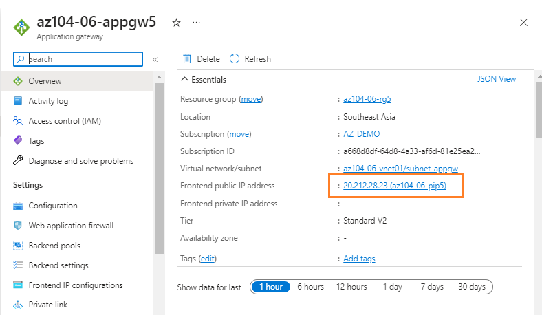 

1. Bên trong **az104-06-appgw5** Application Gateway blade, copy giá trị **Frontend public IP address**.

1. Start một cửa sổ trình duyệt khác và truy cập địa chỉ IP mới vừa copy.

1. Xác nhận rằng trình duyệt hiển thị message **Hello World from az104-06-vm2** hoặc **Hello World from az104-06-vm3**.

    

    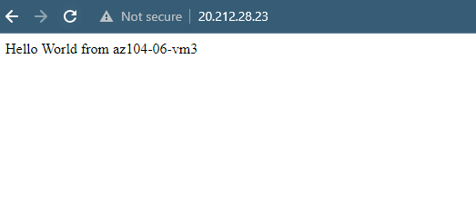  

    > **Note**: Nhắm mục tiêu các máy ảo trên nhiều virtual networks không phải là một cấu hình phổ biến, nhưng nó nhằm minh họa khả năng mà Application Gateway thực hiện, đó là nhắm mục tiêu trên nhiều virtual network (cũng như các endpoints ở các Azure regions khác hoặc thậm chí bên ngoài Azure), không giống như Azure Load Balancer, nó giúp cân bằng tải trên các máy ảo nằm trong cùng một virtual network.

## Clean up resources

1. Tại Azure portal, mở **PowerShell** session bên trong trình **Cloud Shell**.

1. Liệt kê tất cả các resource groups đã tạo trong bài lab bằng lệnh sau:

   ```powershell
   Get-AzResourceGroup -Name 'az104-06*'
   ```

1. Delete tất cả resource groups bạn đã tạo trong bài lab này bằng lệnh sau:

   ```powershell
   Get-AzResourceGroup -Name 'az104-06*' | Remove-AzResourceGroup -Force -AsJob
   ```

## Review

Trong bài lab này, bạn đã:

+ Xây dựng môi trường lab
+ Cấu hình hub và spoke network topology
+ Kiểm tra tính bắc cầu của virtual network peering
+ Cấu hình routing trong mô hình hub and spoke
+ Triển khai Azure Load Balancer
+ Triển khai Azure Application Gateway
