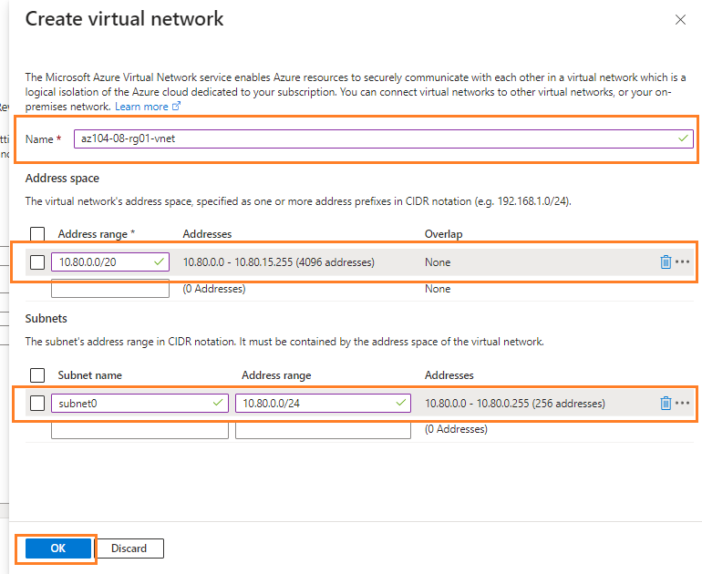
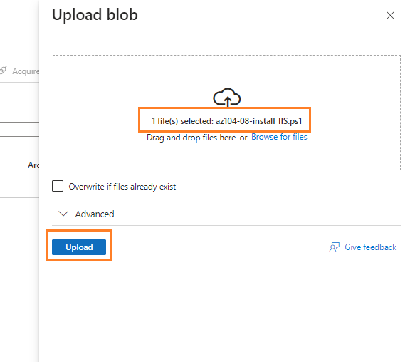
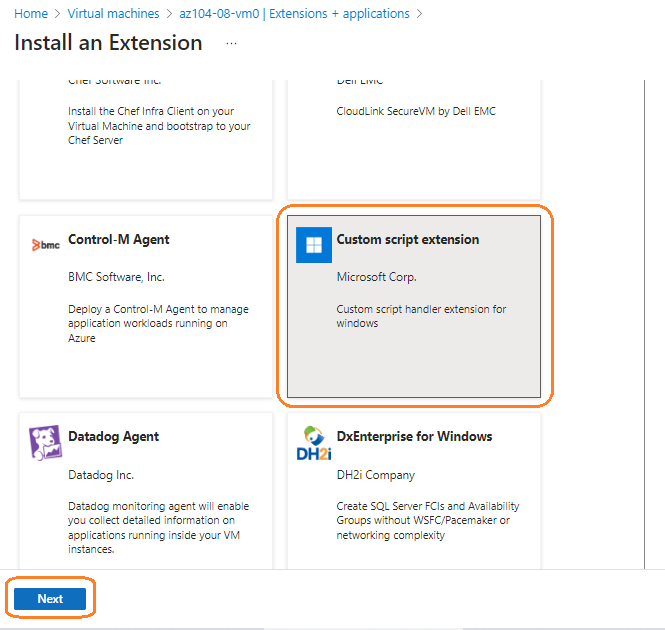
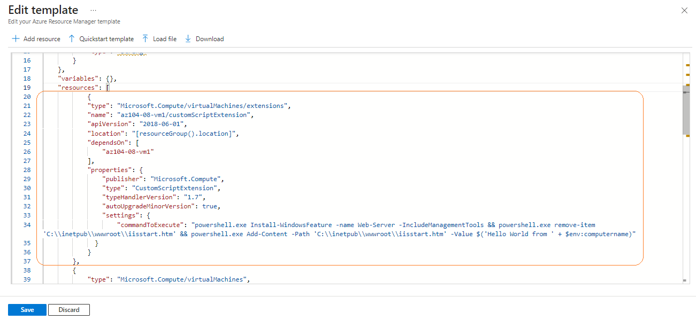
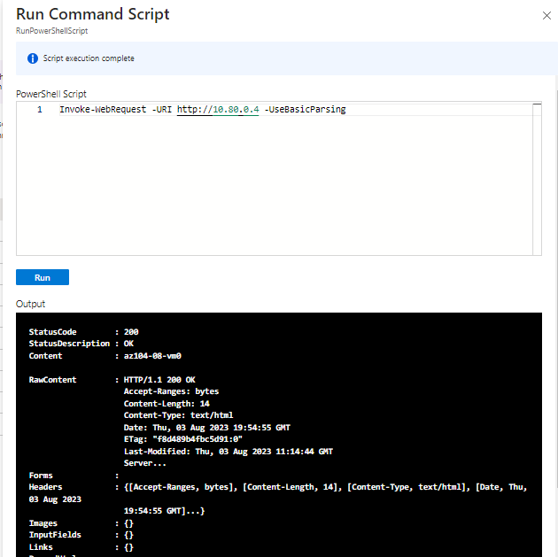
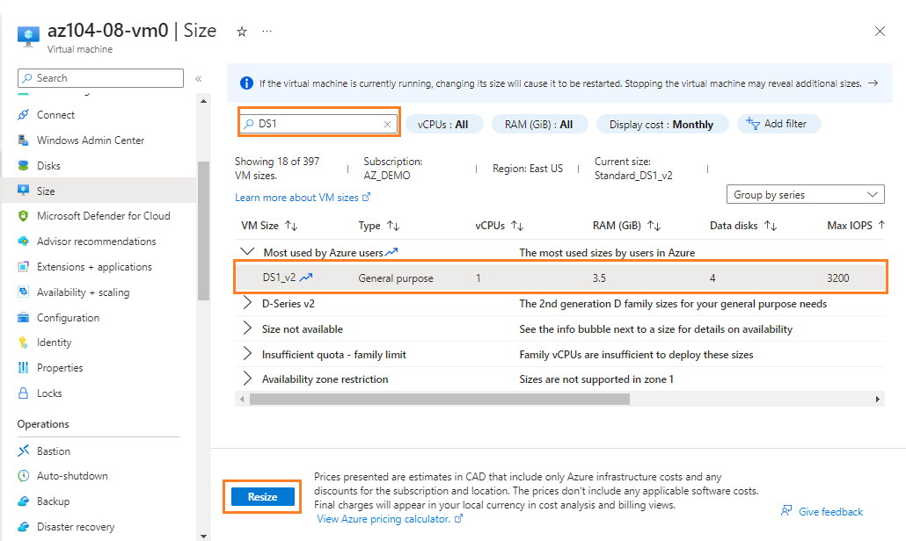
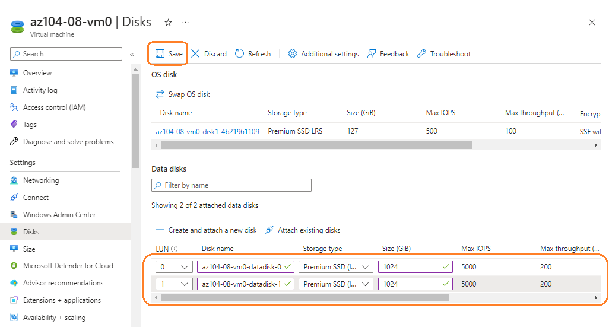
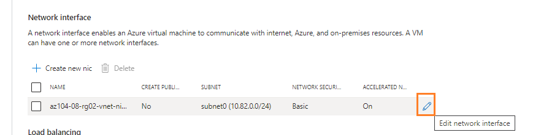
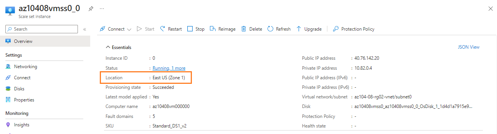
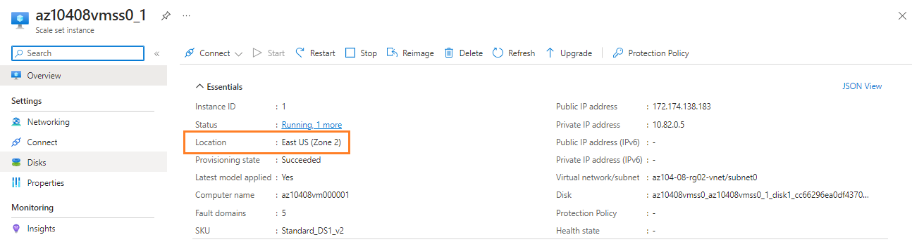

Lab 11 - Manage Virtual Machines (Resiliency and Scalability)


## Lab scenario

Bạn có nhiệm vụ xác định các tùy chọn khác nhau để triển khai và cấu hình Azure virtual machines. Trước tiên, bạn cần xác định các tùy chọn khả năng mở rộng và khả năng phục hồi compute và storage khác nhau mà bạn có thể triển khai khi sử dụng Azure virtual machines. Tiếp theo, bạn cần điều tra các tùy chọn khả năng mở rộng và khả năng phục hồi compute và storage có sẵn khi sử dụng Azure virtual machine scale sets. Bạn cũng muốn khám phá khả năng tự động cấu hình virtual machines và virtual machine scale sets bằng cách sử dụng Azure Virtual Machine Custom Script extension.

## Objectives

Trong bài lab này, bạn sẽ thực hiện:

+ Task 1: Triển khai zone-resilient Azure virtual machine bằng cách sử dụng Azure portal và Azure Resource Manager template
+ Task 2: Cấu hình Azure virtual machine bằng cách sử dụng virtual machine extensions
+ Task 3: Mở rộng compute và storage cho Azure virtual machine
+ Task 4: Đăng ký resource providers Microsoft.Insights và Microsoft.AlertsManagement
+ Task 5: Triển khai zone-resilient Azure virtual machine scale sets bằng cách sử dụng Azure portal
+ Task 6: Cấu hình Azure virtual machine scale sets bằng cách sử dụng virtual machine extensions
+ Task 7: Mở rộng compute và storage cho Azure virtual machine scale sets (optional)

## Architecture diagram


### Instructions

## Exercise 1

## Task 1: Triển khai zone-resilient Azure virtual machine bằng cách sử dụng Azure portal và Azure Resource Manager template

Trong task này, bạn sẽ deploy các máy ảo vào các availability zone khác nhau bằng cách sử dụng Azure portal và an Azure Resource Manager template.

1. Đăng nhập vào [Azure portal](https://portal.azure.com).

1. Tại Azure portal, tìm và chọn vào **Virtual machines**, bên trong **Virtual machines** blade, click **+ Create**, click **+ Azure virtual machine**.

1. Phần **Basics** tab của **Create a virtual machine** blade, chỉ định các thiết lập sau:

    | Setting | Value |
    | --- | --- |
    | Subscription | **Chọn vào subscription của bạn** |
    | Resource group | **az104-08-rg01** (Create new) |
    | Virtual machine name | **az104-08-vm0** |
    | Region | **chọn một trong các regions có hỗ trợ availability zones** |
    | Availability options | **Availability zone** |
    | Availability zone | **Zone 1** |
    | Image | **Windows Server 2019 Datacenter - Gen2** |
    | Azure Spot instance | **No** |
    | Size | **Standard D2s v3** |
    | Username | **Student** |
    | Password | **VnPro@123456** |
    | Public inbound ports | **None** |
    | Would you like to use an existing Windows Server license? | **Unchecked** |

1. Click **Next: Disks >** và tại **Disks** tab, chỉ định các thiết lập sau:

    | Setting | Value |
    | --- | --- |
    | OS disk type | **Premium SSD** |
    | Enable Ultra Disk compatibility | **Unchecked** |

1. Click **Next: Networking >** và tại **Networking** tab, click **Create new** bên dưới textbox **Virtual network**.

1. Trong phần **Create virtual network**, chỉ định các thiết lập sau:

    | Setting | Value |
    | --- | --- |
    | Name | **az104-08-rg01-vnet** |
    | Address range | **10.80.0.0/20** |
    | Subnet name | **subnet0** |
    | Subnet range | **10.80.0.0/24** |

    

1. Click **OK** và quay lại **Networking** tab, chỉ định các thiết lập sau:

    | Setting | Value |
    | --- | --- |
    | Subnet | **subnet0** |
    | Public IP | **default** |
    | NIC network security group | **basic** |
    | Public inbound Ports | **None** |

1. Click **Next: Management >** và trong phần **Management** tab, chỉ định các thiết lập sau:

    | Setting | Value |
    | --- | --- |
    | Patch orchestration options | **Manual updates** |  

1. Click **Next: Monitoring >** và trong phần **Monitoring** tab, chỉ định các thiết lập sau:

    | Setting | Value |
    | --- | --- |
    | Boot diagnostics | **Enable with custom storage account** |
    | Diagnostics storage account | create new |
    | Name | **diagnosticsstoragevnpro** |

1. Chọn **Review + Create**, sau đó chọn **Create**.

1. Tại phần deployment, click **Template**.

1. Kiểm tra lại các giá trị trong template và click **Deploy**.

    >**Note**: Bạn sẽ sử dụng cách này để deploy máy ảo thứ hai, với cấu hình tương tự ngoại trừ availability zone.

1. Tại phần **Custom deployment**, chọn các thiết lập sau:

    | Setting | Value |
    | --- | --- |
    | Resource Group | **az104-08-rg01** |
    | Network Interface Name | **az104-08-vm1-nic1** |
    | Public IP Address Name | **az104-08-vm1-ip** |
    | Virtual Machine Name, Virtual Machine Name1, Virtual Machine Computer Name | **az104-08-vm1** |
    | Virtual Machine RG | **az104-08-rg01** |    
    | Admin Username | **Student** |
    | Admin Password | **VnPro@123456**  |
    | Enable Hotpatching | **false** |
    | Zone | **2** |

1. Click **Review + Create**, sau đó click **Create**.

## Task 2: Cấu hình Azure virtual machine bằng cách sử dụng virtual machine extensions

Trong task này, bạn sẽ cài đặt Windows Server Web Server role lên hai máy ảo đã deploy ở task 1 bằng cách sử dụng Custom Script virtual machine extension.

1. Trong Azure portal, tìm kiếm và chọn **Storage accounts** và trong **Storage accounts** blade, click vàog diagnostics storage account bạn đã tạo ở task trước.

1. Trong storage account blade, tại **Data Storage** section, click **Containers** và click **+ Container**.

1. Tại phần **New container**, chỉ định các cấu hình sau và click **Create**:

    | Setting | Value |
    | --- | --- |
    | Name | **scripts** |
    | Public access level | **Private (no anonymous access**) |

1. Quay lại phần storage account nơi hiển thị danh sách các containers, chọn vào **scripts**.

1. Trong container **scripts**, click **Upload**.

1. Trong phần **Upload blob**, upoad file **az104-08-install_IIS.ps1**, nằm ở thư mục **\\file-labs\\11**. Trở lại **Upload blob** blade, click **Upload**.

    

1. Ở tại Azure portal, truy cập vào **Virtual machines**, click **az104-08-vm0**.

1. Bên trong **az104-08-vm0** virtual machine blade, ở phần **Settings** section, click **Extensions + applications**, sau đó click **+ Add**.

1. Trong phần **Install an Extension**, click **Custom Script Extension** sau đó click **Next**.

    

1. Tại **Configure Custom Script Extension Extension** blade, click **Browse**.

1. Chọn vào storage account nơi bạn đã upload **az104-08-install_IIS.ps1** script, 
Click **scripts**, chọn file **az104-08-install_IIS.ps1** và ấn **select**.

1. Quay lại phần **Install extension**, click **Review + create** và sau đó click **Create**.

1. Ở tại Azure portal, truy cập vào **Virtual machines**, click **az104-08-vm1**.

1. Tại trang **az104-08-vm1**, trong **Automation** section, click **Export template**. 

1. Tại phần **az104-08-vm1 - Export template**, click **Deploy**.

1. Tại trang **Custom deployment**, click **Edit template**.

1. Trong phần **Edit template**, ở nơi hiển thị nội dung template, chèn thêm đoạn code sau ở dòng **20** (ngay bên dưới dòng `"resources": [`):
in the section displaying the content of the template, insert the following code starting with line **20** (directly underneath the `"resources": [` line):

   ```json
        {
            "type": "Microsoft.Compute/virtualMachines/extensions",
            "name": "az104-08-vm1/customScriptExtension",
            "apiVersion": "2018-06-01",
            "location": "[resourceGroup().location]",
            "dependsOn": [
                "az104-08-vm1"
            ],
            "properties": {
                "publisher": "Microsoft.Compute",
                "type": "CustomScriptExtension",
                "typeHandlerVersion": "1.7",
                "autoUpgradeMinorVersion": true,
                "settings": {
                    "commandToExecute": "powershell.exe Install-WindowsFeature -name Web-Server -IncludeManagementTools && powershell.exe remove-item 'C:\\inetpub\\wwwroot\\iisstart.htm' && powershell.exe Add-Content -Path 'C:\\inetpub\\wwwroot\\iisstart.htm' -Value $('Hello World from ' + $env:computername)"
              }
            }
        },

   ```

    

1. Click **Save** quay lại trang **Custom template**, click **Review + Create** sau đó click **Create**

1. Để chắc chắn rằng Custom Script extension-based đã được cấu hình thành công, quay lại **az104-08-vm1** blade, trong mục **Operations**, click **Run command**, trong danh sách các command, chọn **RunPowerShellScript**.

1. Nhập lệnh sau và click **Run** để truy cập trang web được host trên on **az104-08-vm0**:

   ```powershell
   Invoke-WebRequest -URI http://10.80.0.4 -UseBasicParsing
   ```

    

## Task 3: Mở rộng compute và storage cho Azure virtual machine

Trong task này bạn sẽ mở rộng dịch vụ điện toán cho máy ảo Azure bằng cách thay đổi size của chúng và mở rộng storage bằng cách đính kèm và cấu hình data disks của chúng.

1. Trong Azure portal, tìm và chọn **Virtual machines**, click **az104-08-vm0**.

1. Bên trong **az104-08-vm0** virtual machine blade, click **Size** và chỉnh virtual machine size thành **Standard DS1_v2** và click **Resize**

    >**Note**: Có thể chọn size khác nếu **Standard DS1_v2** không khả dụng.

    

1. Trong phần **az104-08-vm0** virtual machine, click **Disks**, bên dưới **Data disks** click **+ Create and attach a new disk**.

1. Tạo ra một data disk với thiết lập sau: 

    | Setting | Value |
    | --- | --- |
    | Disk name | **az104-08-vm0-datadisk-0** |
    | Storage type | **Premium SSD** |
    | Size (GiB| **1024** |

1. Tiếp tục tạo ra một data disk thứ hai, bên dưới **Data disks** click **+ Create and attach a new disk**.

1. Create a managed disk with the following settings (leave others with their default values) and Save changes:

    | Setting | Value |
    | --- | --- |
    | Disk name | **az104-08-vm0-datadisk-1** |
    | Storage type | **Premium SSD** |
    | Size (GiB)| **1024 GiB** |

1. Sau khi thêm 2 data disk, click **Save** để lưu lại cấu hình.

    

1. Tại **az104-08-vm0** blade, trong **Operations** section, click **Run command**, và click **RunPowerShellScript**.

1. Nhập commands sau và click **Run** để tạo ra một ổ đĩa Z: Bao gồm hai ổ đĩa mới:

   ```powershell
   New-StoragePool -FriendlyName storagepool1 -StorageSubsystemFriendlyName "Windows Storage*" -PhysicalDisks (Get-PhysicalDisk -CanPool $true)

   New-VirtualDisk -StoragePoolFriendlyName storagepool1 -FriendlyName virtualdisk1 -Size 64GB -ResiliencySettingName Simple -ProvisioningType Fixed

   Initialize-Disk -VirtualDisk (Get-VirtualDisk -FriendlyName virtualdisk1)

   New-Partition -DiskNumber 4 -UseMaximumSize -DriveLetter Z
   ```

1. Trong Azure portal, tìm và chọn **Virtual machines**, click **az104-08-vm1**.

1. Tại **az104-08-vm1** blade, trong **Automation** section, click **Export template**, sau đó click **Deploy**

1. Tại trang **Custom deployment**, click **Edit template**.

    >**Note**: Disregard the message stating **The resource group is in a location that is not supported by one or more resources in the template. Please choose a different resource group**. This is expected and can be ignored in this case.

1. Tại khung **Edit template**, tại dòng **30** thay thế giá trị `"vmSize": "Standard_D2s_v3"` bằng giá trị sau:

   ```json
                    "vmSize": "Standard_DS1_v2"

   ```

1. Tiếp theo, tại dòng **51** thay thế (`"dataDisks": [ ]`) với đoạn code sau:

   ```json
                    "dataDisks": [
                      {
                        "lun": 0,
                        "name": "az104-08-vm1-datadisk0",
                        "diskSizeGB": "1024",
                        "caching": "ReadOnly",
                        "createOption": "Empty"
                      },
                      {
                        "lun": 1,
                        "name": "az104-08-vm1-datadisk1",
                        "diskSizeGB": "1024",
                        "caching": "ReadOnly",
                        "createOption": "Empty"
                      }
                    ]
   ```

1. Click **Save** và quay lại trang **Custom deployment**, click **Review + Create** sau đó click **Create**.

1. Tại **az104-08-vm1** blade, trong **Operations** section, click **Run command**, và click **RunPowerShellScript**.

1. Nhập commands sau và click **Run** để tạo ra một ổ đĩa Z: Bao gồm hai ổ đĩa mới:

   ```powershell
   New-StoragePool -FriendlyName storagepool1 -StorageSubsystemFriendlyName "Windows Storage*" -PhysicalDisks (Get-PhysicalDisk -CanPool $true)

   New-VirtualDisk -StoragePoolFriendlyName storagepool1 -FriendlyName virtualdisk1 -Size 2046GB -ResiliencySettingName Simple -ProvisioningType Fixed

   Initialize-Disk -VirtualDisk (Get-VirtualDisk -FriendlyName virtualdisk1)

   New-Partition -DiskNumber 4 -UseMaximumSize -DriveLetter Z
   ```

## Task 4: Đăng ký resource providers Microsoft.Insights và Microsoft.AlertsManagement

1. Trong Azure portal, mở **Azure Cloud Shell** bằng cách chọn vào icon trên thanh menu bên phải.

1. Giữa **Bash** hay **PowerShell**, chọn **PowerShell**.

1. Trong phần Cloud Shell, chạy lệnh sau để đăng ký resource providers Microsoft.Insights và Microsoft.AlertsManagement.

   ```powershell
   Register-AzResourceProvider -ProviderNamespace Microsoft.Insights

   Register-AzResourceProvider -ProviderNamespace Microsoft.AlertsManagement
   ```

## Task 5: Triển khai zone-resilient Azure virtual machine scale sets bằng cách sử dụng Azure portal

1. Tại the Azure portal, Tìm và chọn **Virtual machine scale sets**, click **+ Add** (hoặc **+ Create**).

1. Tại **Basics** tab, khai báo cấu hình sau và click **Next : Disks >**:

    | Setting | Value |
    | --- | --- |
    | Subscription | **Chọn vào subscription của bạn** |
    | Resource group | **az104-08-rg02** (Create new) |
    | Virtual machine scale set name | **az10408vmss0** |
    | Region | **East US** |
    | Availability zone | **Zones 1, 2, 3** |
    | Orchestration mode | **Uniform** |
    | Image | **Windows Server 2019 Datacenter - Gen2** |
    | Run with Azure Spot discount | **No** |
    | Size | **Standard D2s_v3** |
    | Username | **Student** |
    | Password | **VnPro@123456**  |
    | Already have a Windows Server license? | **Unchecked** |

1. Di chuyển tới **Networking** tab, click **Create virtual network** bên dưới **Virtual network** textbox và tạo ra một virtual network mới:

    | Setting | Value |
    | --- | --- |
    | Name | **az104-08-rg02-vnet** |
    | Address range | **10.82.0.0/20** |
    | Subnet name | **subnet0** |
    | Subnet range | **10.82.0.0/24** |

1. Tiếp theo click vào biểu tượng **Edit network interface**.

    

1. Ở trang **Edit network interface**, trong phần **NIC network security group** section, click **Advanced** và click **Create new**:

    | Setting | Value |
    | --- | --- |
    | Name | **az10408vmss0-nsg** |

1. Click **Add an inbound rule**:

    | Setting | Value |
    | --- | --- |
    | Source | **Any** |
    | Source port ranges | **\*** |
    | Destination | **Any** |
    | Destination port ranges | **80** |
    | Protocol | **TCP** |
    | Action | **Allow** |
    | Priority | **1010** |
    | Name | **custom-allow-http** |

1. Click **Add** và quay lại trang **Create network security group**, click **OK**.

1. Tại trang **Edit network interface**, trong phần **Public IP address**, click **Enabled** và click **OK**.

1. Quay lại **Networking** tab, dưới **Load balancing** section, khai báo cấu hình sau:

    | Setting | Value |
    | --- | --- |
    | Load balancing options | **Azure load balancer** |
    | Select a load balancer | **Create a load balancer** |
    
1.  Tại trang **Create a load balancer**, khai báo tên của load balancer. Click **Create** và **Next : Scaling >**.
    
    | Setting | Value |
    | --- | --- |
    | Load balancer name | **az10408vmss0-lb** |

1. Tại **Scaling** tab, khai báo cấu hình như sau và click **Next : Management >**:

    | Setting | Value |
    | --- | --- |
    | Initial instance count | **2** |
    | Scaling policy | **Manual** |

1. Trong **Management** tab, chỉ định các thiết lập sau:

    | Setting | Value |
    | --- | --- |
    | Boot diagnostics | **Enable with custom storage account** |
    | Diagnostics storage account | **diagnosticsstoragevnpro1** |

   Click **Next : Health >**:

1. click **Next : Advanced >**.

1. Tại **Advanced** tab, chỉ định cấu hình sau và click **Review + create**.

    | Setting | Value |
    | --- | --- |
    | Spreading algorithm | **Fixed spreading (not recommended with zones)** |

1. Tại **Review + create** tab, chắc chắn rằng validation đã pass và click **Create**.

## Task 6: Cấu hình Azure virtual machine scale sets bằng cách sử dụng virtual machine extensions

Trong task này, bạn sẽ cài đặt Windows Server Web Server role trên các instances của Azure virtual machine scale set mà bạn đã deploy ở task trước bằng cách sử dụng Custom Script virtual machine extension.

1. Tại Azure portal, Tìm và chọn **Storage accounts** and, chọn vào storage account bạn đã tạp ra cùng với Azure virtual machine scale set ở task trước.

1. Tại storage account blade, trong **Data Storage** section, click **Containers** sau đó click **+ Container**. Khai báo thông tin container và click **Create**:

    | Setting | Value |
    | --- | --- |
    | Name | **scripts** |
    | Public access level | **Private (no anonymous access**) |

1. Trở lại storage account blade, click **scripts**.

1. Trong **scripts** container, click **Upload**.

1. Trong phần **Upload blob**, upoad file **az104-08-install_IIS.ps1**, nằm ở thư mục **\\file-labs\\11**. Trở lại **Upload blob** blade, click **Upload**.

1. Tại trang Azure portal, di chuyển đến **Virtual machine scale sets** blade và click **az10408vmss0**.

1. Trong phần **Settings** section, click **Extensions and applications**,và click **+ Add**.

1. Tìm và click **Custom Script Extension** sau đó click **Next**.

1. **Browse** và **Select** vào **az104-08-install_IIS.ps1** script bạn vừa upload, sau đó click **Create**.

1. Trong phần **Settings** section của **az10408vmss0** blade, click **Instances**, chọn vào checkboxes bên cạnh hai instances của virtual machine scale set, click **Upgrade**, click **Yes**.

1. Tại Azure portal, tìm kiếm và chọn **Load balancers**, click **az10408vmss0-lb**.

1. Trong **az10408vmss0-lb** blade, copy **Public IP address** của load balancer, và mở một tab trình duyệt mới, truy cập bằng địa chỉ ip đó.

    >**Note**: Trang web sẽ hiển thị tên của một trong 2 instances của Azure virtual machine scale set **az10408vmss0**

## Task 7: Mở rộng compute và storage cho Azure virtual machine scale sets

Trong task này, bạn sẽ thay đổi size của virtual machine scale set instances, cấu hình autoscaling cho các instances, và gắn thêm ổ cứng.

1. Trong Azure portal, tìm kiếm và chọn **Virtual machine scale sets**, chọn vào **az10408vmss0**.

1. Trong **Settings** section, click **Size**.

1. Trong danh sách các size có sẵn, chọn **Standard DS1_v2** và click **Resize**.

1. Trong **Settings** section, click **Instances**, check vào 2 checkboxes cạnh hai instances của virtual machine scale set, chọn **Upgrade** và chọn **Yes**.

1. Tại danh sách các instances, click vào instance đầu tiên và tại phần scale set instance, chú ý vào **Location** hiện tại (nó phải là một trong các zone trong target Azure region mà bạn đã deploy).

    

1. Quay lại **az10408vmss0 - Instances**, chọn vào instance thứ hai và chú ý vào **Location** của instance (nó phải là một trong hai zone còn lại trong target Azure region mà bạn đã deploy).

    

1. Quay lại **az10408vmss0 - Instances**, trong phần **Settings** section, click **Scaling**.

1. Tại trang **az10408vmss0 - Scaling** blade, select **Custom autoscale** option và cấu hình autoscale với các thiết lập sau:

    | Setting | Value |
    | --- |--- |
    | Scale mode | **Scale based on a metric** |

1. Click vào **+ Add a rule** link vào trong phần **Scale rule**, chỉ định rule như sau:

    | Setting | Value |
    | --- |--- |
    | Metric source | **Current resource (az10480vmss0)** |
    | Time aggregation | **Average** |
    | Metric namespace | **Virtual Machine Host** |
    | Metric name | **Network In Total** |
    | Operator | **Greater than** |
    | Metric threshold to trigger scale action | **10** |
    | Duration (in minutes) | **1** |
    | Time grain statistic | **Average** |
    | Operation | **Increase count by** |
    | Instance count | **1** |
    | Cool down (minutes) | **5** |

    >**Note**: Cấu hình này thường không được sử dụng trong thực tế, chỉ vì mục địch kích hoạt tính năng autoscaling nhanh nhất có thể mà không cần chờ đợi.

1. Click **Add** và quay lại phần **az10408vmss0 - Scaling** blade, khai báo thêm cấu hình sau:

    | Setting | Value |
    | --- |--- |
    | Instance limits Minimum | **1** |
    | Instance limits Maximum | **3** |
    | Instance limits Default | **1** |

1. Click **Save**.

1. Tại Azure portal, mở **Azure Cloud Shell** bằng cách click vào biểu tượng trên cùng bên phải của Azure Portal. Chọn **PowerShell**.

1. Tại Cloud Shell, chạy các dòng lệnh sau để xác định IP public của load balance phía trước của Azure virtual machine scale set **az10408vmss0**.

   ```powershell
   $rgName = 'az104-08-rg02'

   $lbpipName = 'az10408vmss0-ip'

   $pip = (Get-AzPublicIpAddress -ResourceGroupName $rgName -Name $lbpipName).IpAddress
   ```

1. Tại Cloud Shell, chạy lệnh sau để bắt đầu một vòng lặp vô hạn gửi các HTTP requests đến trang web được host trên các instances của Azure virtual machine scale set **az10408vmss0**.

   ```powershell
   while ($true) { Invoke-WebRequest -Uri "http://$pip" }
   ```

1. Thu nhỏ khung Cloud Shell nhưng không đóng nó, chuyển sang **az10408vmss0 - Instances** và theo dõi số lượng instances.

1. Sau khi instance thứ 3 được cung cấp, hay điều hướng tới instance đó và quan sát **Location** 
Once the third instance is provisioned, navigate to its blade to determine its **Location** (Nó sẽ nằm ở zone khác với 2 instance trước đó mà bạn xem).

1. Tắt trình Cloud Shell.

## Clean up resources

1. Xóa az104-08-configure_VMSS_disks.ps1 bằng cách chạy lệnh sau:

   ```powershell
   rm ~\az104-08*
   ```

1. Xóa tất cả resource group trong bài lab này bằng cách chạy lệnh sau: 

   ```powershell
   Get-AzResourceGroup -Name 'az104-08*' | Remove-AzResourceGroup -Force -AsJob
   ```

## Review

In this lab, you have:

+ Triển khai zone-resilient Azure virtual machine bằng cách sử dụng Azure portal và Azure Resource Manager template
+ Cấu hình Azure virtual machine bằng cách sử dụng virtual machine extensions
+ Mở rộng compute và storage cho Azure virtual machine
+ Đăng ký resource providers Microsoft.Insights và Microsoft.AlertsManagement
+ Triển khai zone-resilient Azure virtual machine scale sets bằng cách sử dụng Azure portal
+ Cấu hình Azure virtual machine scale sets bằng cách sử dụng virtual machine extensions
+ Mở rộng compute và storage cho Azure virtual machine scale sets (optional)